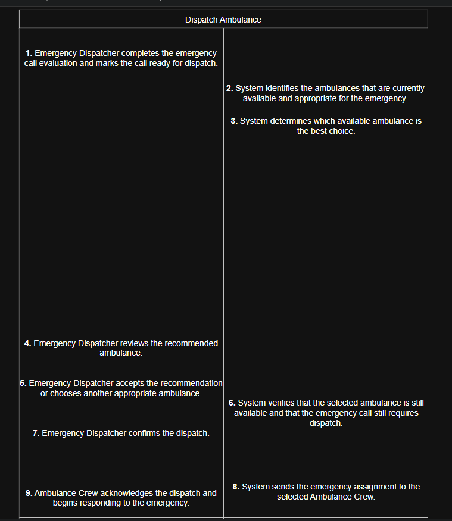

# Ambulance Call Center and Dispatch System


## Description
This project demonstrates three things — Spring Boot MVC architecture, the Facade design pattern, and a priority queue — implemented as a computer-aided dispatch (CAD) system for an ambulance call center. 


## Problem

People need to call for an ambulance and get medical help to go to the hospital. The call center needs to be able to dispatch ambulances or request other government services. 
Dispatch needs to be able to allocate emergency tickets out to ambulances. Ambulances must accept the emergency. Emergency tickets are put into a priority queue.   

What is multiple calls come in at once. 


## Project Objectives

### 1. Demonstrate Spring Boot MVC
This project demonstrates the mvc architecture. Specific methods are being used for view and controller. 


### 2. Demonstrate Data Structures and Algorithm Analysis
A priority queue is being used for the queue. 

### 3. Demonstrate Object-Oriented Design and Refactoring
Grasp and solid principles. 


### 4. Demonstrate Design Traceability
All use cases are broken down into behaviors allocated to domain entities. All use case are traced to sequence diagram. Then all behaviors are traced to bdd test scenarios.  

## Table of Contents

- [Ambulance Call Center and Dispatch System](#ambulance-call-center-and-dispatch-system)
  - [Description](#description)
  - [Problem](#problem)
  - [Project Objectives](#project-objectives)
    - [1. Demonstrate Spring Boot MVC](#1-demonstrate-spring-boot-mvc)
    - [2. Demonstrate Data Structures and Algorithm Analysis](#2-demonstrate-data-structures-and-algorithm-analysis)
    - [3. Demonstrate Object-Oriented Design and Refactoring](#3-demonstrate-object-oriented-design-and-refactoring)
    - [4. Demonstrate Design Traceability](#4-demonstrate-design-traceability)
  - [Table of Contents](#table-of-contents)
  - [Design Process](#design-process)
  - [Assumptions and Open Questions](#assumptions-and-open-questions)
  - [Design Decision Log](#design-decision-log)
  - [UML and OOAD Artifact Analysis](#uml-and-ooad-artifact-analysis)
    - [Domain Model](#domain-model)
    - [Use-Case Diagram](#use-case-diagram)
    - [Use-Case Scenario](#use-case-scenario)
    - [Robustness Diagram](#robustness-diagram)
    - [Sequence Diagram](#sequence-diagram)
    - [Class Diagram](#class-diagram)
    - [How the UML Artifacts Connect](#how-the-uml-artifacts-connect)
  - [Noun Analysis](#noun-analysis)
  - [Domain Modeling](#domain-modeling)
  - [Use Cases](#use-cases)
    - [Emergency Dispatcher](#emergency-dispatcher)
    - [Dispatch Ambulance](#dispatch-ambulance)
    - [Ambulance Crew](#ambulance-crew)
    - [Fleet Supervisor](#fleet-supervisor)
    - [Administrator](#administrator)
  - [UML Class Diagram](#uml-class-diagram)
    - [Classes](#classes)
  - [Application Flow](#application-flow)
    - [BDD Scenarios](#bdd-scenarios)
  - [TDD Traceability to Methods](#tdd-traceability-to-methods)
  - [Class / Method                                      TDD Test](#class--method--------------------------------------tdd-test)
    - [Traceability Summary](#traceability-summary)
  - [Spring Boot MVC Architecture Analysis](#spring-boot-mvc-architecture-analysis)
    - [Why This Is MVC](#why-this-is-mvc)
    - [Model](#model)
    - [View](#view)
    - [Controller](#controller)
    - [MVC Request Flow](#mvc-request-flow)
    - [Spring MVC Controller vs GRASP Controller](#spring-mvc-controller-vs-grasp-controller)
  - [Facade Design Pattern Analysis](#facade-design-pattern-analysis)
    - [Facade Intent](#facade-intent)
    - [Facade Participants](#facade-participants)
    - [Why the Facade Is Necessary](#why-the-facade-is-necessary)
    - [What the Facade Should and Should Not Own](#what-the-facade-should-and-should-not-own)
    - [Facade Request Flow](#facade-request-flow)
    - [Facade Benefits](#facade-benefits)
  - [GRASP, SOLID, and Refactoring Analysis](#grasp-solid-and-refactoring-analysis)
    - [GRASP](#grasp)
    - [SOLID](#solid)
    - [Refactoring](#refactoring)
  - [Data Structures Used](#data-structures-used)
    - [Why a Priority Queue Instead of a Normal Queue](#why-a-priority-queue-instead-of-a-normal-queue)
    - [Why `arrivalSequence` Is Necessary](#why-arrivalsequence-is-necessary)
  - [Big-O Analysis](#big-o-analysis)
    - [Waiting Emergency Calls](#waiting-emergency-calls)
    - [Ambulance and Dispatch Lookup](#ambulance-and-dispatch-lookup)
    - [Availability Tracking](#availability-tracking)
    - [Dispatch History](#dispatch-history)
    - [Candidate Evaluation](#candidate-evaluation)
    - [End-to-End Dispatch Complexity](#end-to-end-dispatch-complexity)
  - [Installation](#installation)
    - [Prerequisites](#prerequisites)
    - [Clone the Project](#clone-the-project)
    - [Run the Backend](#run-the-backend)
    - [Run the Frontend](#run-the-frontend)
  - [AI Usage](#ai-usage)


## Design Process


## Assumptions and Open Questions


## UML and OOAD Artifact Analysis


### Domain Model


### Use-Case Scenario


### Dispatch Ambulance





## Robustness Analysis


## Sequence Diagram


### Classes


## Application Flow


### View


### Controller


### MVC Request Flow


## Facade Design Pattern Analysis

### Facade Intent


### Facade Participants


### Why the Facade Is Necessary


### Facade Request Flow


## GRASP, SOLID, and Refactoring Analysis

### GRASP


### SOLID


## Data Structures Used

The project intentionally uses different data structures for different access patterns.

| Data Structure | Field / Use | Why It Fits the Problem |
|---|---|---|
| `PriorityQueue<EmergencyCall>` | `waitingCalls` | The system repeatedly needs the highest-precedence waiting emergency rather than simply the oldest call. A heap-backed priority queue makes the next call efficient to retrieve. |
| `EmergencyCallComparator` | Priority queue ordering policy | Encapsulates the comparison rule: medical priority first, `arrivalSequence` second. |
| `HashMap<Integer, Ambulance>` | `fleetById` | Ambulances are frequently located by unique ID. Hash lookup is more appropriate than scanning a list for every access. |
| `HashSet<Integer>` | `availableAmbulanceIds` | Availability is fundamentally a membership question: is this ambulance currently in the available set? |
| `HashMap<Integer, DispatchRecord>` | `activeDispatchesByAmbulanceId` | Supports direct lookup of the active dispatch associated with a particular ambulance. |
| `HashMap<Long, DispatchRecommendation>` | `recommendationsById` | Allows a dispatcher approval or override request to locate the pending recommendation by recommendation ID. |
| `ArrayList<DispatchRecord>` | `dispatchHistory` | Dispatch history is append-oriented and benefits from efficient ordered storage and indexed traversal. |


## Big-O Analysis

Let:

- `n` = number of waiting emergency calls
- `a` = number of ambulances being considered
- `r` = number of pending recommendations
- `d` = number of active dispatches
- `h` = number of historical dispatch records

### Waiting Emergency Calls

Java `PriorityQueue` is heap-backed.

| Operation | Expected Complexity | Dispatch Meaning |
|---|---:|---|
| `peek()` | `O(1)` | Inspect the next emergency call without removing it. |
| `offer()` / `add()` | `O(log n)` | Add a newly evaluated emergency call while restoring heap order. |
| `poll()` | `O(log n)` | Remove the highest-precedence emergency call and restore heap order. |
| Arbitrary search by call ID | `O(n)` if iteration is used | A heap is optimized for the root element, not arbitrary lookup. |
| Arbitrary removal | `O(n)` search + heap repair | Removing a non-root item requires locating it first. |

The important design tradeoff is that the application optimizes the operation it performs most conceptually: **determine the next call to handle**.

If a sorted list were used instead, either insertion or repeated sorting would become more expensive. If a plain FIFO queue were used, the complexity could be good while the dispatch semantics would be wrong.

### Ambulance and Dispatch Lookup

`HashMap` is used where the system knows an identifier and needs the associated object.

Typical average-case complexity is:

| Operation | Average | Worst Case |
|---|---:|---:|
| `HashMap.get(key)` | `O(1)` | `O(n)` theoretical worst case |
| `HashMap.put(key, value)` | `O(1)` amortized | `O(n)` theoretical worst case |
| `HashMap.remove(key)` | `O(1)` average | `O(n)` theoretical worst case |

This applies to structures such as:

```text
fleetById
activeDispatchesByAmbulanceId
recommendationsById
```

Direct hash lookup is preferable to repeatedly scanning an `ArrayList` of ambulances or recommendations, which would require `O(a)` or `O(r)` search time.

### Availability Tracking

`availableAmbulanceIds` is a `HashSet<Integer>`.

Typical average-case operations are:

```text
contains(id)  → O(1)
add(id)       → O(1) amortized
remove(id)    → O(1) average
```

This makes the set appropriate for fast availability membership tracking.

The set does not replace the `Ambulance` object as the authority on whether a transition is valid. It is a supporting index that must remain consistent with domain state.

### Dispatch History

`dispatchHistory` is an `ArrayList<DispatchRecord>`.

Typical costs are:

```text
append to end       → O(1) amortized
get by index        → O(1)
iterate all history → O(h)
search by predicate → O(h)
insert in middle    → O(h)
```

An `ArrayList` fits an append-heavy history because completed dispatches are naturally retained in sequence and commonly reviewed by iteration.

### Candidate Evaluation

Identifying an appropriate ambulance may require examining the candidate fleet. Suitability checks such as availability, duty status, capability, and jurisdiction are constant-time checks per ambulance when the required values are already in memory.

A full scan of `a` ambulance candidates is therefore approximately:

```text
O(a)
```

Travel-estimate calls add external I/O cost that Big-O notation does not represent well. From the local algorithm's perspective, evaluating each candidate is linear in the number of candidates, but real elapsed time may be dominated by route-provider latency.

The exact complexity of `CadRecommendationService.recommend(...)` depends on its implementation. If it scans candidates while retaining only the current best choice, it is `O(a)`. If it sorts all candidates before selecting the first, it is `O(a log a)`. The current design documentation establishes candidate comparison but does not by itself prove which of those two internal strategies the implementation uses.

### End-to-End Dispatch Complexity

For the core waiting-call operation:

```text
peek next call             O(1)
scan/evaluate ambulances   O(a)
lookup recommendation      O(1) average
lookup selected ambulance  O(1) average
commit/removal from heap   O(log n) when removing the root
append dispatch history    O(1) amortized
```

Ignoring external routing latency, a simplified successful dispatch is therefore dominated by candidate evaluation plus heap mutation:

```text
O(a + log n)
```

That expression assumes the emergency being committed is the root/next item in the priority queue and candidate selection is implemented as a linear best-choice scan. If the code searches for an arbitrary waiting call or sorts all ambulance candidates, the bound changes accordingly.

This analysis demonstrates an important design lesson: Big-O should be applied to the operation actually being performed, not merely attached to the name of a data structure.


### Testing 

### BDD Scenarios

Sunny 
Rainy day 
Zero
One
Many
Bounary behaviors
Interface definitions
Exerise exceptional behavior 
Negative test cases
Edge cases 


## TDD Traceability to Methods


## Design Decision Log


## Installation


### Prerequisites

Before running the application, make sure the following software is installed:

- Java Development Kit (JDK) 21 or later
- Maven
- Node.js
- npm
- Git
- IntelliJ IDEA, Eclipse, VS Code, or another Java-compatible IDE

Optional:

- Google Routes API key for Google-backed route and travel estimates


### Clone the Project

```bash
git clone <repository-url>
cd ambulance-dispatch-system
```


### Run the Backend

```bash
mvn spring-boot:run
```

Run the Java tests:

```bash
mvn test
```


### Run the Frontend

```bash
cd frontend
npm install
npm run dev
```

Build the frontend:

```bash
npm run build
```


## AI Usage

AI was used as a design and review assistant during parts of the requirements analysis, noun analysis, domain modeling, use-case modeling, robustness analysis, sequence-diagram review, MVC/GRASP/SOLID review, data-structure analysis, testing, and documentation work.

Course-required ChatGPT share links can be added below:

https://chatgpt.com/share/<add-link>  
https://chatgpt.com/share/<add-link>  
https://chatgpt.com/share/<add-link>
