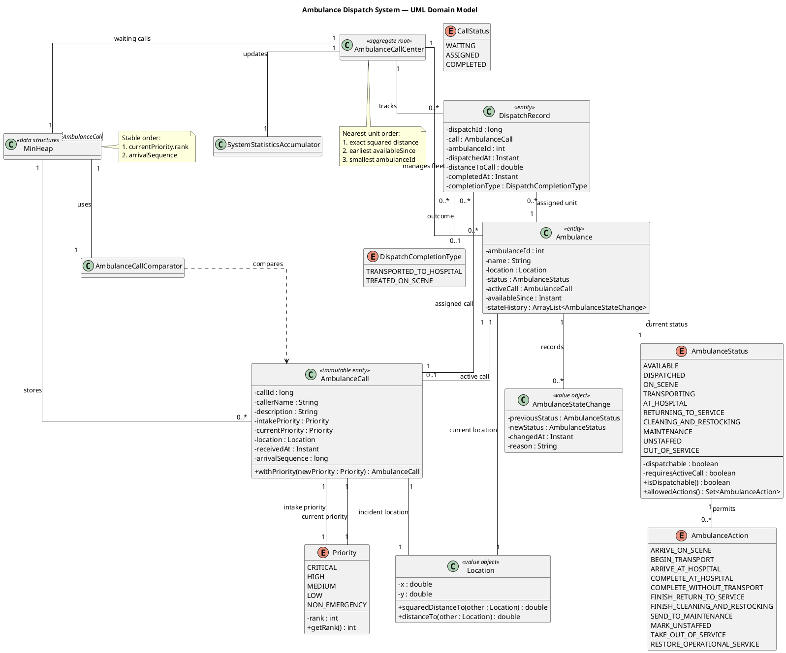
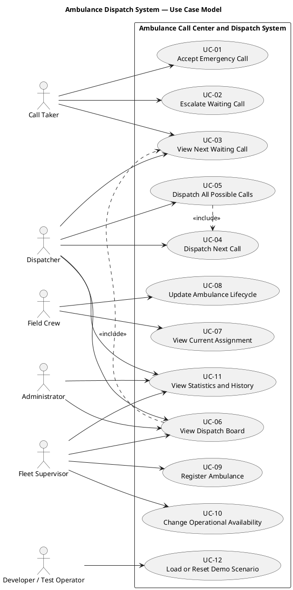
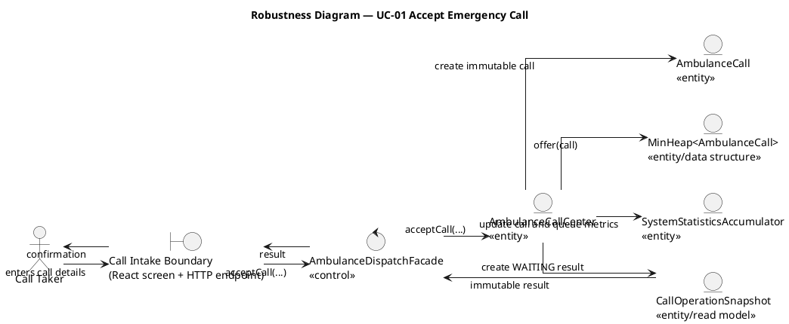
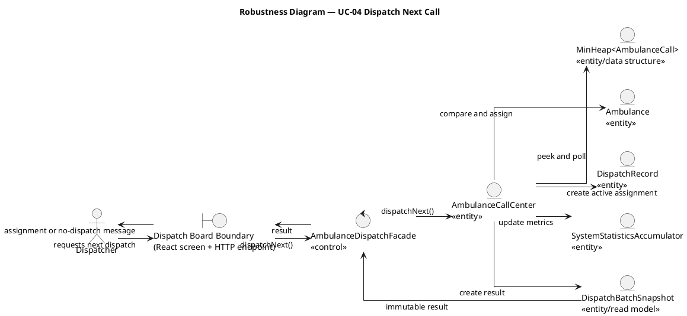
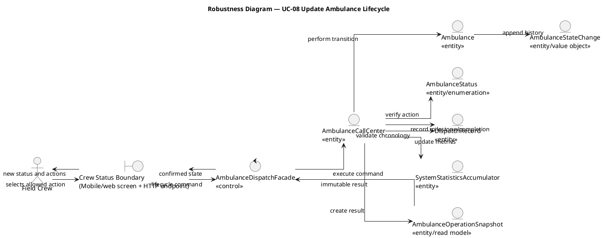
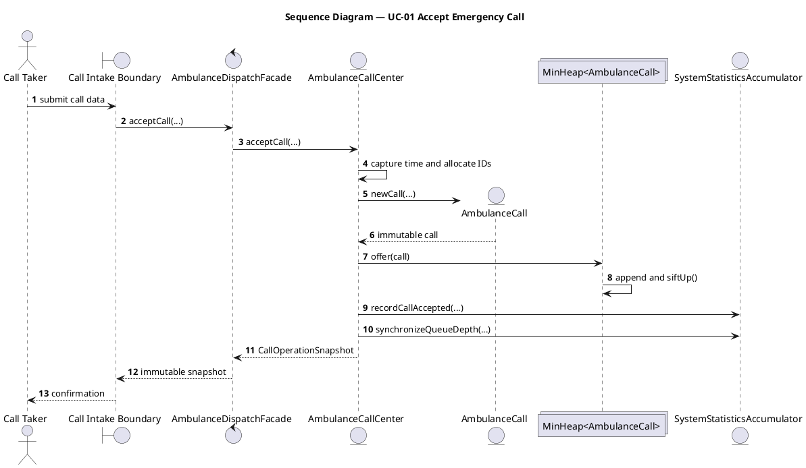
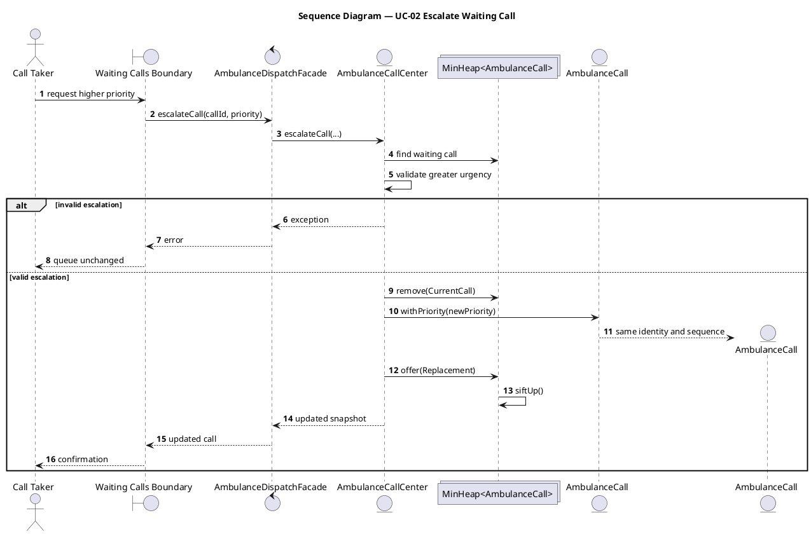
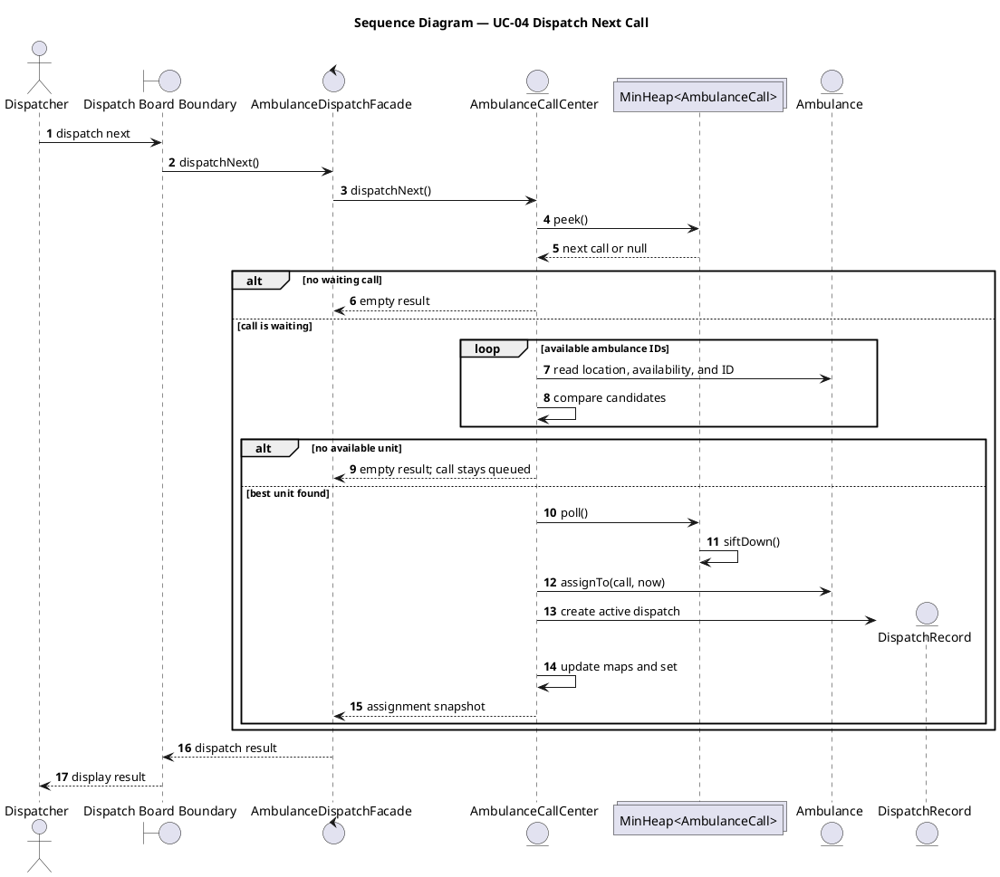
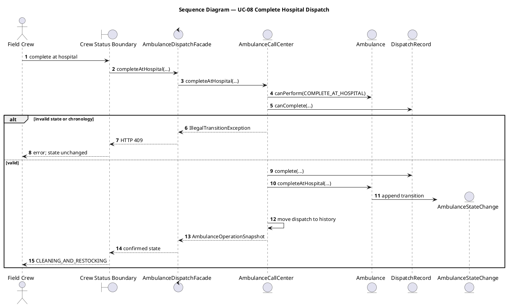

# Ambulance Call Center and Dispatch System

## ICS 240 Data Structures and Software Design Case Study

### Demonstrating MVC, a Custom Min-Heap Priority Queue, GRASP, SOLID, the Facade Pattern, and Behavior-Preserving Refactoring

This Java, Spring Boot, and React project models an ambulance call-center and
dispatch system while demonstrating the central learning goals of
**ICS 240 — Data Structures**.

The project's primary purpose is not merely to create an ambulance application.
Its primary purpose is to demonstrate how custom data structures and
object-oriented design principles work together inside a realistic software
architecture.

The main educational focus is:

- **Model-View-Controller (MVC)** for separation of presentation, HTTP, and
  domain responsibilities.
- A custom generic **`MinHeap<E>`** used as the production priority queue.
- Stable emergency-call ordering using priority and first-come-first-served
  arrival sequence.
- Purposeful use of `HashMap`, `HashSet`, `ArrayList`, `EnumMap`, and
  `EnumSet`.
- **Big-O analysis** of queue, dispatch, lookup, lifecycle, reporting, and
  history operations.
- **GRASP** for assigning responsibilities with high cohesion and low coupling.
- **SOLID** for maintainable object-oriented design.
- The **Facade design pattern** as the synchronized application boundary.
- **Refactoring** that improves structure without changing required behavior.
- JUnit, Cucumber BDD, REST API testing, ZOMBIES, exploratory negative testing,
  and mobile-test planning.

Google Maps, live GPS, PWA support, Capacitor packaging, and Appium are realistic
extensions that exercise the architecture. They support the educational goals
without replacing the custom data structures as the center of the project.

---

## Project Status

**Design status:** Complete  
**Core implementation status:** Built and dependency-free self-test verified  
**Spring/React/mobile status:** Implemented foundation; external dependency builds still need to run on a development machine

This repository now includes:

- Custom generic `MinHeap<E>` used as the production waiting-call queue
- Stable `AmbulanceCallComparator`
- Immutable call model with intake and current priority
- Ten-state guarded `Ambulance` lifecycle
- `DispatchRecord` chronology and completion behavior
- Hash-map fleet and active-dispatch indexes
- Hash-set available-unit index
- Incremental `EnumMap` statistics
- `AmbulanceCallCenter` aggregate and invariant verification
- Thread-safe `AmbulanceDispatchFacade`
- Immutable snapshot records
- Spring MVC request/response DTOs, mapper, controllers, and exception handling
- Development-only demo loader and endpoints
- JUnit 5 test sources organized around ZOMBIES, happy, rainy-day, and negative cases
- Cucumber BDD feature files and Java step definitions
- Dependency-free executable core self-test with concurrency coverage
- React API/context layer connected to the REST contracts
- Five clearly separated role-specific MVC Views with hash-based navigation
- PWA manifest, service worker, offline warning, and app icons
- Capacitor configuration
- Appium + Cucumber mobile-test module foundation

Verified in this generated build:

```text
All production Java source compiled successfully against local framework stubs.
The framework-free core and facade compiled with Java 21.
The executable core self-test passed 37 checks.
```

Remaining environment-dependent work:

- Run `mvn test` on a machine with Maven and dependency access.
- Run `npm install`, lint, and the Vite production build.
- Generate Capacitor `android/` and `ios/` native projects.
- Connect real authentication and backend role authorization.
- Complete device-specific Appium setup steps for a running emulator or device.

---

# Table of Contents

- [Project Goals](#project-goals)
- [Core Requirements](#core-requirements)
- [Architecture](#architecture)
- [UML and ICONIX Analysis Models](#uml-and-iconix-analysis-models)
- [UML Domain Model](#uml-domain-model)
- [Use-Case Model](#use-case-model)
- [Detailed Use Cases](#detailed-use-cases)
- [Robustness Analysis](#robustness-analysis)
- [Sequence Diagrams](#sequence-diagrams)
- [Use-Case Traceability Matrix](#use-case-traceability-matrix)
- [Data Structures](#data-structures)
- [Queue Ordering](#queue-ordering)
- [Big-O Analysis](#big-o-analysis)
- [Ambulance Selection](#ambulance-selection)
- [Ambulance Lifecycle](#ambulance-lifecycle)
- [Project Structure](#project-structure)
- [Backend Classes](#backend-classes)
- [Role-Specific MVC Views](#role-specific-mvc-views)
- [REST API Plan](#rest-api-plan)
- [RESTful API Testing](#restful-api-testing)
- [Testing Strategy](#testing-strategy)
- [Complete Data-Structure Inventory](#complete-data-structure-inventory)
- [ZOMBIES Testing Strategy](#zombies-testing-strategy)
- [Happy-Path Testing](#happy-path-testing)
- [Rainy-Day Testing](#rainy-day-testing)
- [Negative Test Cases](#negative-test-cases)
- [Live GPS and Google Maps Route Support](#live-gps-and-google-maps-route-support)
- [Mobile Support](#mobile-support)
- [Running the Project](#running-the-project)
- [GRASP Analysis](#grasp-analysis)
- [SOLID Analysis](#solid-analysis)
- [Implementation Milestones and Remaining Work](#implementation-milestones-and-remaining-work)
- [Definition of Complete](#definition-of-complete)
- [Design Documents](#design-documents)
- [Final Summary](#final-summary)

---

# Project Goals

The project demonstrates the relationship between algorithms, data structures,
and object-oriented programming.

The system must:

- Accept emergency calls.
- Assign each call a priority.
- Preserve first-come-first-served order among equal-priority calls.
- Handle calls that arrive at the same time.
- Use a min heap as a priority queue.
- Select the nearest available ambulance.
- Track ambulance status changes.
- Prevent illegal lifecycle transitions.
- Record active and completed dispatches.
- Maintain operational statistics.
- Support desktop, tablet, and mobile interfaces.
- Support unit, BDD, API, and mobile automation testing.

---

# Core Requirements

## Stable emergency-call ordering

Calls are ordered by:

```text
1. Current priority rank
2. Arrival sequence
```

Priority ranks:

```text
CRITICAL      = 1
HIGH          = 2
MEDIUM        = 3
LOW           = 4
NON_EMERGENCY = 5
```

A lower numeric rank means greater urgency.

`arrivalSequence` is used instead of the timestamp as the final tie-breaker
because two calls may have identical timestamps.

## Explicit dispatch behavior

Accepting a call does not silently dispatch an ambulance.

Call intake and dispatch are separate operations:

```text
acceptCall(...)
dispatchNext()
dispatchAllPossibleCalls()
```

This keeps behavior visible, testable, and easier to explain.

## Backend-owned operational state

The Java backend is authoritative for:

- Call IDs
- Dispatch IDs
- Arrival sequence numbers
- Queue ordering
- Ambulance selection
- Ambulance status
- Dispatch history
- Statistics
- Legal lifecycle actions

React and mobile clients display state and request operations, but they do not
replace the backend rules.

---

# Architecture

```text
React / PWA / Capacitor
          |
          v
DispatchDataProvider
          |
          v
dispatchApi
          |
          v
Spring MVC Controllers
          |
          v
AmbulanceDispatchFacade
          |
          v
AmbulanceCallCenter
          |
          +------------------------------+
          |              |               |
          v              v               v
      MinHeap       Domain Models    Statistics
```

Dependency direction:

```text
frontend -> HTTP -> web -> service -> core
```

The core package must not depend on:

```text
Spring
HTTP
JSON
React
Capacitor
Appium
Cucumber
```

This allows the core to run independently in:

- JUnit tests
- Cucumber domain tests
- Console demonstrations
- Spring Boot
- Web clients
- Mobile clients

---


# UML and ICONIX Analysis Models

The README includes four complementary modeling views:

| Model | Purpose |
|---|---|
| Domain model | Shows the important domain concepts, attributes, and relationships |
| Use-case model | Shows actors and the goals they accomplish |
| Robustness analysis | Connects each use case to boundary, control, and entity objects |
| Sequence diagrams | Shows the chronological messages exchanged during a use case |

All diagram sources are also stored in:

```text
docs/uml/
```

The robustness diagrams follow the ICONIX interaction rule:

```text
Actor -> Boundary -> Control -> Entity
```

---

# UML Domain Model



Full source:

```text
docs/uml/domain-model.puml
```

## Domain-model interpretation

- One `AmbulanceCallCenter` manages zero or more ambulances.
- The call center stores waiting calls in one custom min heap.
- An ambulance has zero or one active call.
- An ambulance records zero or more lifecycle changes.
- A dispatch record refers to exactly one call and one assigned ambulance.
- A dispatch completion type is absent while a dispatch remains active.
- `AmbulanceCall` is an immutable entity because `callId` provides identity.
- Priority escalation preserves call identity, intake priority, timestamp, and
  arrival sequence.

---

# Use-Case Model



Full source:

```text
docs/uml/use-case-model.puml
```

## Use-case summary

| ID | Use case | Primary actor | Goal |
|---|---|---|---|
| UC-01 | Accept Emergency Call | Call Taker | Validate and insert a call into the waiting min heap |
| UC-02 | Escalate Waiting Call | Call Taker | Increase the current priority of a waiting call |
| UC-03 | View Next Waiting Call | Call Taker or Dispatcher | Inspect the heap root without removing it |
| UC-04 | Dispatch Next Call | Dispatcher | Assign the highest-precedence call to the best available ambulance |
| UC-05 | Dispatch All Possible Calls | Dispatcher | Repeat dispatch until calls or available units are exhausted |
| UC-06 | View Dispatch Board | Dispatcher, Fleet Supervisor, Administrator | View queue, fleet, active dispatches, and metrics |
| UC-07 | View Current Assignment | Field Crew | View the crew's current emergency assignment |
| UC-08 | Update Ambulance Lifecycle | Field Crew | Perform one legal ambulance state transition |
| UC-09 | Register Ambulance | Fleet Supervisor | Add an available unit to the fleet |
| UC-10 | Change Operational Availability | Fleet Supervisor | Remove or restore a unit for operational reasons |
| UC-11 | View Statistics and History | Dispatcher, Fleet Supervisor, Administrator | Review metrics and completed activity |
| UC-12 | Load or Reset Demo Scenario | Developer/Test Operator | Create deterministic dev/test state |

---

# Detailed Use Cases

## UC-01 — Accept Emergency Call

**Primary actor:** Call Taker  
**Trigger:** A caller reports an emergency.  
**Precondition:** The intake screen is available.  
**Success guarantee:** One immutable call is added to the waiting heap.  
**Minimum guarantee:** Invalid input changes no queue, counter, or statistic.

### Main success scenario

1. The call taker enters caller name, description, priority, and location.
2. The boundary validates the request shape.
3. The facade acquires its synchronization monitor.
4. The call center captures the current time.
5. The call center allocates a call ID and arrival sequence.
6. An immutable `AmbulanceCall` is created.
7. The call is inserted into `MinHeap<AmbulanceCall>`.
8. The heap restores its invariant with sift-up.
9. Statistics record intake priority and queue depth.
10. The system returns a `WAITING` call snapshot.
11. The UI displays confirmation.

### Rainy-day alternatives

- Calls may share a timestamp; arrival sequence resolves order.
- No ambulance may be available; intake still succeeds because dispatch is a
  separate use case.
- A large queue still accepts the call in O(log c).

### Negative cases

- Blank caller name or description.
- Missing or unsupported priority.
- Missing location.
- `NaN` or infinite coordinates.
- Repeated submission while the first request is pending.

### Postconditions

```text
waitingCalls contains the new call
queue depth increased by one
accepted-call statistics increased
no ambulance was silently dispatched
```

## UC-02 — Escalate Waiting Call

**Primary actor:** Call Taker  
**Precondition:** The call exists and is `WAITING`.  
**Success guarantee:** Current priority becomes more urgent while identity and
FCFS sequence remain unchanged.

### Main success scenario

1. The actor selects a waiting call and a more urgent priority.
2. The call center finds the call in the heap.
3. The requested rank is verified as more urgent.
4. The old immutable call instance is removed.
5. `withPriority(...)` creates a replacement call.
6. Call ID, intake priority, time, location, and sequence are preserved.
7. The replacement is offered to the heap.
8. Heap order is restored.
9. Escalation statistics are updated.

### Negative cases

- Call does not exist.
- Call is assigned or completed.
- New priority is equal, less urgent, or null.

## UC-04 — Dispatch Next Call

**Primary actor:** Dispatcher  
**Success guarantee:** Exactly one best available ambulance is assigned to the
heap root.  
**Minimum guarantee:** When no unit is available, the call remains waiting.

### Main success scenario

1. Dispatcher requests the next dispatch.
2. Call center peeks at the heap root.
3. Only IDs in `availableAmbulanceIds` are scanned.
4. Candidates are compared by exact squared distance.
5. Equal distance is resolved by earliest `availableSince`.
6. The final tie is resolved by smallest ambulance ID.
7. Only after a unit is found does the call center poll the heap.
8. Ambulance transitions `AVAILABLE -> DISPATCHED`.
9. A `DispatchRecord` is created and indexed by ambulance ID.
10. The ambulance ID is removed from the available set.
11. Statistics and snapshots are updated.

### Rainy-day alternatives

- Empty queue: return an empty dispatch batch.
- No available ambulance: return an empty batch and leave the call queued.
- Limited fleet: remaining calls stay in the heap.

### Negative cases

- Availability index references a missing or unavailable ambulance.
- Concurrent requests attempt to assign the same call or unit.

## UC-05 — Dispatch All Possible Calls

The system repeats UC-04 until either:

```text
waitingCalls is empty
or
availableAmbulanceIds is empty
```

Five calls and two units produce two assignments and leave three calls waiting.

## UC-08 — Update Ambulance Lifecycle

**Primary actor:** Field Crew  
**Success guarantee:** One legal state transition and corresponding dispatch
milestone are recorded.  
**Minimum guarantee:** An illegal request changes no entity, index, history, or
statistic.

### Transport path

```text
DISPATCHED
-> ON_SCENE
-> TRANSPORTING
-> AT_HOSPITAL
-> CLEANING_AND_RESTOCKING
-> AVAILABLE
```

### No-transport alternative

```text
ON_SCENE
-> RETURNING_TO_SERVICE
-> AVAILABLE
```

### Negative cases

- Begin transport before arriving on scene.
- Arrive at hospital before transport.
- Complete without transport while transporting.
- Complete the same dispatch twice.
- Record a milestone before an earlier milestone.
- Repeat a mobile action while a request is pending.

## UC-09 — Register Ambulance

1. Fleet supervisor provides ID, name, and location.
2. Call center verifies that the ID is unique.
3. A new `AVAILABLE` ambulance is created.
4. It is inserted into `fleetById`.
5. Its ID is inserted into `availableAmbulanceIds`.
6. Fleet statistics are updated.

Negative cases include duplicate ID, blank name, invalid location, and
unauthorized role.

## UC-10 — Change Operational Availability

Removal paths:

```text
AVAILABLE -> MAINTENANCE
AVAILABLE -> UNSTAFFED
AVAILABLE -> OUT_OF_SERVICE
```

Restoration paths:

```text
MAINTENANCE -> AVAILABLE
UNSTAFFED -> AVAILABLE
OUT_OF_SERVICE -> AVAILABLE
```

A unit with an active dispatch cannot be operationally removed.

## UC-11 — View Statistics and History

The facade captures an immutable snapshot under its monitor. The mapper
converts the snapshot after the monitor is released.

Boundary cases include empty history, page size one, first page, final partial
page, and a page beyond available history.

---

# Robustness Analysis

## Robustness stereotypes

| Stereotype | Responsibility |
|---|---|
| Boundary | React/mobile screen and HTTP-facing interaction |
| Control | `AmbulanceDispatchFacade`, which coordinates the use case |
| Entity | Core domain object, aggregate, data structure, statistic, or snapshot |

## UC-01 — Accept Emergency Call



Source:

```text
docs/uml/robustness-accept-call.puml
```

## UC-04 — Dispatch Next Call



Source:

```text
docs/uml/robustness-dispatch-next.puml
```

## UC-08 — Update Ambulance Lifecycle



Source:

```text
docs/uml/robustness-update-lifecycle.puml
```

---

# Sequence Diagrams

## UC-01 — Accept Emergency Call



Source:

```text
docs/uml/sequence-accept-call.puml
```

## UC-02 — Escalate Waiting Call



Source:

```text
docs/uml/sequence-escalate-call.puml
```

## UC-04 — Dispatch Next Call



Source:

```text
docs/uml/sequence-dispatch-next.puml
```

## UC-08 — Complete Hospital Dispatch



Source:

```text
docs/uml/sequence-complete-hospital-dispatch.puml
```

---

# Use-Case Traceability Matrix

| Use case | Boundary | Control | Core entities | Data structures | Endpoint | Primary tests |
|---|---|---|---|---|---|---|
| UC-01 Accept Call | Call intake / `CallController` | Facade | Call center and call | Min heap, backing `ArrayList`, `EnumMap` metrics | `POST /api/calls` | Validation, heap offer, BDD intake |
| UC-02 Escalate | Waiting calls / `CallController` | Facade | Call center and call | Heap remove and reinsert | `PATCH /api/calls/{id}/priority` | Preserve intake priority and sequence |
| UC-03 View Next | Queue boundary | Facade | Call snapshot | Heap root | `GET /api/calls/next` | Zero, one, and many heap tests |
| UC-04 Dispatch Next | Dispatch board / `DispatchController` | Facade | Call center, ambulance, dispatch | Heap, fleet map, available set, active map | `POST /api/dispatch/next` | Nearest unit, ties, no-unit, concurrency |
| UC-05 Dispatch All | Dispatch board | Facade | Same as UC-04 | Same as UC-04 plus result list | `POST /api/dispatch/all` | Many calls and limited fleet |
| UC-06 View Board | Board / `SystemController` | Facade | Board snapshots | Sorted heap copy and immutable lists | `GET /api/state` | Snapshot immutability |
| UC-07 View Assignment | Crew assignment screen | Facade | Ambulance and dispatch snapshots | Active-dispatch map | `GET /api/state` | React and Appium assignment tests |
| UC-08 Lifecycle | Crew status / `AmbulanceController` | Facade | Ambulance, record, state change | Active map, history list, enum actions | Lifecycle POST endpoints | Legal/illegal transitions and chronology |
| UC-09 Register Unit | Fleet screen / `AmbulanceController` | Facade | Call center and ambulance | Fleet map and available set | `POST /api/ambulances` | Valid and duplicate ID |
| UC-10 Availability | Fleet screen | Facade | Ambulance and state change | Fleet map, available set, history | Maintenance/restore endpoints | Illegal active-unit removal |
| UC-11 Reports | Reports / `SystemController` | Facade | Statistics and history snapshots | `EnumMap`, history `ArrayList` | `/api/statistics`, `/api/history` | Zero/one/many metrics and pagination |
| UC-12 Demo | `DemoController` | Demo loader and facade | Public application operations | All normal structures | `/api/demo/load`, `/reset` | Development-profile integration |

---

# Data Structures

## Waiting calls

```java
MinHeap<AmbulanceCall>
```

Purpose:

- Return the highest-priority waiting call.
- Preserve stable FCFS order.
- Support insertion and root removal efficiently.

## Fleet lookup

```java
HashMap<Integer, Ambulance>
```

Purpose:

- Average O(1) ambulance lookup by ID.

## Available ambulance index

```java
HashSet<Integer>
```

Purpose:

- Average O(1) availability membership.
- Average O(1) add and remove.
- Restrict nearest-unit scanning to available ambulances.

## Active dispatch lookup

```java
HashMap<Integer, DispatchRecord>
```

Key:

```text
ambulance ID
```

Purpose:

- Average O(1) active-dispatch lookup for lifecycle updates.

## Completed history

```java
ArrayList<DispatchRecord>
```

Purpose:

- Amortized O(1) append.
- Indexed history pagination.

## Ambulance transition history

```java
ArrayList<AmbulanceStateChange>
```

Purpose:

- Append-only lifecycle audit trail.

## Statistics

```java
EnumMap<Priority, ...>
EnumMap<AmbulanceStatus, ...>
```

Purpose:

- Efficient fixed-category statistics.

---

# Queue Ordering

The comparator uses:

```text
currentPriority.rank
then arrivalSequence
```

Example:

```text
Call A: HIGH, sequence 7
Call B: HIGH, sequence 8
```

Call A is processed first.

Example:

```text
Call A: MEDIUM, sequence 2
Call B: CRITICAL, sequence 9
```

Call B is processed first because priority is compared before arrival order.

## Priority escalation

Calls preserve:

```text
intakePriority
currentPriority
```

When a call is escalated:

1. Find the waiting call.
2. Remove the immutable old instance.
3. Create a replacement with the same ID and arrival sequence.
4. Change only `currentPriority`.
5. Reinsert it into the min heap.

The original intake priority remains available for auditing and statistics.

---


# Big-O Analysis

Let:

```text
c = waiting calls
v = available ambulances
a = all ambulances
d = active dispatches
p = requested history page size
```

| Operation | Complexity |
|---|---:|
| Accept call | O(log c) |
| Peek next call | O(1) |
| Poll next call | O(log c) |
| Escalate waiting call | O(c + log c) |
| Register ambulance | Average O(1) |
| Lookup ambulance | Average O(1) |
| Availability membership | Average O(1) |
| Select nearest ambulance | O(v) |
| Successful dispatch | O(v + log c) |
| Lifecycle update | Average O(1) |
| Append dispatch history | Amortized O(1) |
| Statistics update | O(1) |
| Ordered waiting view | O(c log c) |
| Full board | O(c log c + a + d) |
| History page | O(p) |
| Full invariant verification | O(c + a + d) |

---

# Ambulance Selection

The call center scans only available ambulance IDs.

Candidate ambulances are compared by:

```text
1. Exact squared distance
2. Earlier availableSince
3. Smaller ambulance ID
```

Squared distance is used because square roots are unnecessary when comparing
relative distance.

No epsilon-based tie rule is used. Exact comparison guarantees deterministic
selection regardless of `HashSet` iteration order.

Successful dispatch complexity:

```text
O(v + log c)
```

where:

```text
v = available ambulances
c = waiting calls
```

---

# Ambulance Lifecycle

## Transport path

```text
AVAILABLE
-> DISPATCHED
-> ON_SCENE
-> TRANSPORTING
-> AT_HOSPITAL
-> CLEANING_AND_RESTOCKING
-> AVAILABLE
```

## No-transport path

```text
AVAILABLE
-> DISPATCHED
-> ON_SCENE
-> RETURNING_TO_SERVICE
-> AVAILABLE
```

## Operational removal

```text
AVAILABLE -> MAINTENANCE
AVAILABLE -> UNSTAFFED
AVAILABLE -> OUT_OF_SERVICE
```

## Operational restoration

```text
MAINTENANCE -> AVAILABLE
UNSTAFFED -> AVAILABLE
OUT_OF_SERVICE -> AVAILABLE
```

The `Ambulance` class provides guarded, intention-revealing methods.

Examples:

```java
assignTo(...)
arriveOnScene(...)
beginTransport(...)
arriveAtHospital(...)
completeAtHospital(...)
completeWithoutTransport(...)
finishReturnToService(...)
finishCleaningAndRestocking(...)
sendToMaintenance(...)
markUnstaffed(...)
takeOutOfService(...)
restoreOperationalService(...)
```

There is no public general-purpose `setStatus(...)` method.

---

# Project Structure

## Backend

```text
src/main/java/edu/ics240/dispatch/
├── AmbulanceDispatchApplication.java
├── config/
│   └── DispatchConfiguration.java
├── core/
│   ├── Priority.java
│   ├── CallStatus.java
│   ├── AmbulanceStatus.java
│   ├── AmbulanceAction.java
│   ├── DispatchCompletionType.java
│   ├── Location.java
│   ├── AmbulanceCall.java
│   ├── AmbulanceCallComparator.java
│   ├── AmbulanceStateChange.java
│   ├── Ambulance.java
│   ├── MinHeap.java
│   ├── DispatchRecord.java
│   ├── SystemStatisticsAccumulator.java
│   ├── AmbulanceCallCenter.java
│   ├── snapshot/
│   └── exception/
├── service/
│   └── AmbulanceDispatchFacade.java
├── dto/
│   ├── request/
│   └── response/
├── web/
│   ├── CallController.java
│   ├── AmbulanceController.java
│   ├── DispatchController.java
│   ├── SystemController.java
│   ├── DemoController.java
│   ├── ApiExceptionHandler.java
│   └── mapper/
│       └── DispatchWebMapper.java
├── demo/
│   └── DemoScenarioLoader.java
└── console/
    └── ConsoleDispatchDemo.java
```

## Backend tests

```text
src/test/java/edu/ics240/dispatch/
├── core/
├── service/
├── web/
└── bdd/

src/test/resources/features/
├── call_queue.feature
├── dispatch_ambulance.feature
├── priority_escalation.feature
├── ambulance_lifecycle.feature
└── statistics.feature
```

## Frontend

```text
frontend/src/
├── App.jsx                            <- application shell and role router only
├── main.jsx
├── styles.css
├── api/
│   └── dispatchApi.js                 <- centralized REST client
├── auth/
│   └── roles.js                       <- presentation role metadata
├── context/
│   ├── DispatchDataContext.jsx        <- shared server snapshot and operations
│   └── useDispatchData.js
├── hooks/
│   └── useLiveGeolocation.js
├── maps/
│   └── googleMapsLoader.js
├── components/
│   ├── crew/
│   │   └── CrewRouteMap.jsx
│   ├── layout/
│   │   ├── ApplicationHeader.jsx
│   │   └── RoleNavigation.jsx
│   └── shared/
│       ├── DataCard.jsx
│       ├── Formatting.jsx
│       └── WorkspaceHeader.jsx
└── pages/
    ├── CallTakerWorkspace.jsx
    ├── DispatcherWorkspace.jsx
    ├── FieldCrewWorkspace.jsx
    ├── FleetSupervisorWorkspace.jsx
    └── AdministratorWorkspace.jsx
```

`App.jsx` no longer contains call intake, dispatch controls, fleet operations,
GPS, and administration in one dashboard. It now performs only application-
shell responsibilities: shared header rendering, role navigation, network
status, global errors, loading state, and selection of the active View.

## Mobile automation

```text
mobile-tests/
├── pom.xml
├── src/test/java/edu/ics240/mobile/
│   ├── pages/
│   ├── runners/
│   ├── steps/
│   └── support/
└── src/test/resources/features/mobile/
```

---

# Backend Classes

## Application and configuration

### `AmbulanceDispatchApplication`

Starts Spring Boot.

### `DispatchConfiguration`

Creates:

- UTC clock
- Comparator
- Call center
- Facade
- Web mapper

## Core enums

### `Priority`

Defines urgency rank.

### `CallStatus`

```text
WAITING
ASSIGNED
COMPLETED
```

### `AmbulanceStatus`

Defines lifecycle state, dispatchability, active-call requirements, and legal
actions.

### `AmbulanceAction`

Defines stable action names for web and mobile clients.

### `DispatchCompletionType`

Defines:

```text
TRANSPORTED_TO_HOSPITAL
TREATED_ON_SCENE
```

## Core domain classes

### `Location`

Immutable coordinates and distance behavior.

### `AmbulanceCall`

Immutable call entity containing:

```text
callId
callerName
description
intakePriority
currentPriority
location
receivedAt
arrivalSequence
```

### `AmbulanceCallComparator`

Defines stable queue order.

### `AmbulanceStateChange`

Immutable transition history entry.

### `Ambulance`

Owns one ambulance's guarded lifecycle.

### `DispatchRecord`

Owns one dispatch timeline and completion data.

### `SystemStatisticsAccumulator`

Maintains metrics incrementally.

### `AmbulanceCallCenter`

Owns the complete in-memory dispatch aggregate.

### `MinHeap<E>`

Manual binary min-heap implementation for ICS 240.

## Service

### `AmbulanceDispatchFacade`

Provides the synchronized application boundary.

All core reads and writes must pass through the same monitor.

The facade returns immutable snapshots, not HTTP DTOs.

## Web

### `CallController`

Handles call intake, next-call inspection, and escalation.

### `DispatchController`

Handles explicit dispatch operations.

### `AmbulanceController`

Handles registration and lifecycle actions.

### `SystemController`

Handles state, statistics, history, and state-history queries.

### `DemoController`

Development and test profile only.

### `ApiExceptionHandler`

Maps domain/application exceptions to HTTP responses.

### `DispatchWebMapper`

Maps:

```text
request DTO -> core value
snapshot -> response DTO
```

---

# Role-Specific MVC Views

The React presentation layer is divided into five independent role workspaces.
This separation makes the **View** portion of MVC visible in the source-code
organization instead of hiding every user responsibility inside one large
`App.jsx` dashboard.

```text
App.jsx
  |
  +-- CallTakerWorkspace
  +-- DispatcherWorkspace
  +-- FieldCrewWorkspace
  +-- FleetSupervisorWorkspace
  +-- AdministratorWorkspace
```

Each workspace receives shared authoritative state through
`DispatchDataContext`, displays only information relevant to its actor, and
sends commands through `dispatchApi`. No View directly manipulates the custom
Min Heap, fleet HashMap, availability HashSet, active-dispatch HashMap, history
ArrayList, or statistics EnumMaps.

The complete request path remains:

```text
Role-Specific React View
        -> DispatchDataContext
        -> dispatchApi
        -> Spring MVC Controller
        -> AmbulanceDispatchFacade
        -> AmbulanceCallCenter
        -> Custom Data Structures and Domain Objects
```

## Why the original combined dashboard was refactored

The original `App.jsx` contained call intake, queue monitoring, dispatch
commands, fleet information, active dispatches, GPS tracking, and route display
in one component. That design worked as an early vertical prototype, but it had
several design problems:

- **Low cohesion:** one component represented several unrelated actors.
- **High coupling:** changes to crew GPS could affect call-taker or dispatcher
  rendering.
- **Poor MVC visibility:** the project claimed multiple Views but implemented
  one combined dashboard.
- **Difficult testing:** role behavior could not be tested as a focused unit.
- **Authorization risk:** controls for unrelated roles appeared in the same UI.
- **Growth pressure:** every new feature made `App.jsx` larger and harder to
  understand.

The refactoring applies **Extract Component**, **Move Responsibility**, and
**Introduce Application Shell**. `App.jsx` is now highly cohesive: it selects a
View and renders shared application status. Each actor's View owns only the
presentation behavior required for that actor.

## `App.jsx` — application shell

Responsibilities:

- Determine the active role route.
- Render the application header.
- Render role navigation.
- Display global network, loading, and API-error state.
- Select one role-specific View.

`App.jsx` does not:

- Accept calls.
- Dispatch ambulances.
- Change fleet state.
- Advance ambulance lifecycle state.
- Track crew GPS.
- Load history or statistics directly.
- Manipulate domain data structures.

## `CallTakerWorkspace`

Responsibilities:

- Accept emergency-call information.
- Submit the call through the REST API.
- Display waiting calls.
- Request a valid urgency escalation.
- Display validation or server errors through shared application state.

The Call Taker View does not determine Min Heap position. The backend comparator
orders calls by current priority and arrival sequence.

## `DispatcherWorkspace`

Responsibilities:

- Display the ordered waiting-call queue.
- Show the heap root as the next call.
- Display available and unavailable ambulances.
- Request `dispatchNext` or `dispatchAll`.
- Monitor active dispatches.

The Dispatcher View does not choose which call or ambulance wins. The domain
model polls the Min Heap and performs the deterministic nearest-unit scan.

## `FieldCrewWorkspace`

Responsibilities:

- Select and display one active assignment.
- Display incident and ambulance information.
- Start or stop live GPS reporting.
- Display a Google Maps or Haversine-fallback route.
- Render only lifecycle actions included in backend `allowedActions`.
- Submit a requested lifecycle transition.

The View hides illegal buttons for usability, but the `Ambulance` domain entity
still validates every transition. Frontend visibility is never treated as the
authoritative business rule.

## `FleetSupervisorWorkspace`

Responsibilities:

- Register an ambulance.
- Display all fleet units.
- Request maintenance, unstaffed, and out-of-service transitions.
- Restore an operationally removed unit.
- Capture an audit reason for every fleet-state operation.

This View intentionally excludes call dispatch and field-response actions.

## `AdministratorWorkspace`

Responsibilities:

- Display system-wide statistics.
- Display paginated completed-dispatch history.
- Expose development/test demo loading and reset controls.
- Refresh the authoritative system snapshot.

Development-only controls are isolated here rather than appearing on every
operational screen.

## Role navigation

The initial implementation uses lightweight hash routes:

```text
#/call-taker
#/dispatcher
#/field-crew
#/fleet-supervisor
#/administrator
```

Hash routing keeps each View addressable and supports browser Back and Forward
without adding a routing dependency. The route is currently a demonstration of
presentation separation, not authentication. A future Spring Security
implementation must derive accessible roles from the authenticated account and
enforce authorization on the backend.

## GRASP improvements

| Design decision | GRASP principle | Improvement |
|---|---|---|
| One workspace per actor | High Cohesion | Each View contains closely related presentation responsibilities |
| Shared API context | Indirection | Views do not depend on raw `fetch` calls |
| Thin `App.jsx` shell | Low Coupling | Role changes do not require editing one large dashboard |
| Backend-controlled actions | Information Expert | `Ambulance` and `AmbulanceStatus` determine legal transitions |
| Facade behind Controllers | Controller / Indirection | Views do not coordinate the domain subsystem |

## SOLID improvements

- **Single Responsibility:** each workspace represents one actor's UI concern.
- **Open/Closed:** another role View can be added to the route map without
  rewriting existing workspaces.
- **Liskov Substitution:** the application shell renders any workspace component
  through the same React component contract.
- **Interface Segregation:** users see only the controls needed by their role.
- **Dependency Inversion:** Views depend on the shared context/API boundary, not
  on domain-object or data-structure implementations.

## Tradeoffs

The refactoring creates more files and introduces navigation indirection. That
is intentional. The previous design had fewer files but mixed five actors and
multiple unrelated workflows. The new structure favors maintainability,
testability, role clarity, and demonstrable MVC separation over minimizing the
file count.

Detailed design notes are available in
[`docs/MVC_ROLE_VIEWS.md`](docs/MVC_ROLE_VIEWS.md), and the behavior-preserving
change is recorded as `RF-01` in
[`docs/REFACTORING_HISTORY.md`](docs/REFACTORING_HISTORY.md).

---

# REST API Plan

## Calls

```text
POST  /api/calls
GET   /api/calls/next
PATCH /api/calls/{id}/priority
```

## Dispatch

```text
POST /api/dispatch/next
POST /api/dispatch/all
GET  /api/dispatches/active
```

## Ambulances

```text
POST /api/ambulances
GET  /api/ambulances

POST /api/ambulances/{id}/arrive-on-scene
POST /api/ambulances/{id}/begin-transport
POST /api/ambulances/{id}/arrive-at-hospital
POST /api/ambulances/{id}/complete-at-hospital
POST /api/ambulances/{id}/complete-without-transport
POST /api/ambulances/{id}/finish-return-to-service
POST /api/ambulances/{id}/finish-cleaning
POST /api/ambulances/{id}/maintenance
POST /api/ambulances/{id}/unstaffed
POST /api/ambulances/{id}/out-of-service
POST /api/ambulances/{id}/restore-service
```

## System

```text
GET /api/state
GET /api/statistics
GET /api/history
GET /api/ambulances/{id}/state-history
```

## Demo profile only

```text
POST /api/demo/load
POST /api/demo/reset
```

---

# RESTful API Testing

RESTful API testing is now a separate verification layer between controller
unit tests and full browser/mobile tests.

Its purpose is to prove that the complete MVC request path works correctly:

```text
HTTP Request
    ↓
Spring MVC Controller
    ↓
Bean Validation
    ↓
AmbulanceDispatchFacade
    ↓
AmbulanceCallCenter
    ↓
Custom Data Structures
    ↓
Immutable Snapshot
    ↓
DispatchWebMapper
    ↓
JSON Response
```

The REST tests verify that the min heap, hash-based indexes, lifecycle rules,
Facade synchronization, DTO mapping, and exception handling remain correct
when reached through HTTP.

## Automated REST integration tests

The primary automated class is:

```text
src/test/java/edu/ics240/dispatch/web/RestApiIntegrationTest.java
```

It uses:

```java
@SpringBootTest
@AutoConfigureMockMvc
@ActiveProfiles("test")
```

`MockMvc` exercises the real Spring MVC request pipeline without opening a
network port. The test class resets the in-memory Facade before each test so
every scenario begins from known state.

### Automated coverage

- Valid call intake returns `201 Created`.
- Invalid random user input returns `400 Bad Request`.
- An empty waiting queue returns `204 No Content`.
- Priority escalation preserves intake priority and arrival sequence.
- Dispatch creates one active assignment.
- A call remains waiting when no unit is available.
- Duplicate ambulance IDs return `409 Conflict`.
- Illegal lifecycle operations return `409 Conflict` without mutation.
- The complete transport lifecycle works through REST endpoints.
- New GPS data is accepted and stale GPS data is rejected.
- Invalid history pages return `400 Bad Request`.
- Development/test demo endpoints load and reset deterministic state.

## Manual exploratory REST collection

The project also contains:

```text
api-tests/ambulance-dispatch-api.http
```

The request collection can be executed with IntelliJ's HTTP Client or the VS
Code REST Client extension. It contains happy-path, rainy-day, boundary,
negative, GPS, lifecycle, history, route, and random-user requests.

## REST test categories

### Happy path

```text
register ambulance
accept call
escalate call
dispatch call
progress legal lifecycle
complete dispatch
return unit to availability
read history and statistics
```

### Rainy day

```text
empty queue
no available ambulance
final partial history page
missing Google Routes key with fallback route
no live GPS update while assignment remains visible
```

### Negative and random user behavior

```text
double submission
blank text
invalid coordinates
unsupported enum value
duplicate ambulance ID
stale GPS update
illegal lifecycle action
negative page number
repeated dispatch commands
stale browser-tab command
conflicting concurrent operations
malformed JSON
```

Each failure test verifies both the HTTP error and the unchanged domain state.

## HTTP status contract

| Situation | Expected status |
|---|---:|
| Successful query or command | `200 OK` |
| Successful resource creation | `201 Created` |
| No next waiting call | `204 No Content` |
| Validation or malformed input | `400 Bad Request` |
| Missing resource | `404 Not Found` |
| Duplicate or illegal transition | `409 Conflict` |
| Unauthenticated request after security | `401 Unauthorized` |
| Unauthorized role after security | `403 Forbidden` |
| Unexpected failure | `500 Internal Server Error` |

## Running REST tests

```bash
mvn -Dtest=RestApiIntegrationTest test
```

Run the complete test suite:

```bash
mvn test
```

The full testing rationale, endpoint matrix, examples, and traceability are in:

```text
docs/REST_API_TESTING.md
```

---

# Testing Strategy

## JUnit

JUnit verifies individual classes and aggregate behavior.

Required test classes include:

```text
PriorityTest
LocationTest
AmbulanceCallTest
AmbulanceCallComparatorTest
MinHeapTest
AmbulanceStateChangeTest
AmbulanceTest
DispatchRecordTest
SystemStatisticsAccumulatorTest
AmbulanceCallCenterTest
AmbulanceDispatchFacadeTest
FacadeConcurrencyTest
SnapshotImmutabilityTest
NearestAmbulanceSelectionTest
HistoryPaginationTest
```

## Cucumber BDD

Cucumber expresses business behavior with Gherkin.

Example:

```gherkin
Feature: Stable emergency call ordering

  Scenario: Equal-priority calls remain first come first served
    Given a HIGH priority call arrived first
    And another HIGH priority call arrived second
    When the dispatcher examines the next waiting call
    Then the first call should be returned
```

Example:

```gherkin
Feature: Explicit dispatch

  Scenario: Accepting a call does not silently dispatch an ambulance
    Given ambulance 101 is available
    When a call taker accepts a CRITICAL call
    Then the call should be WAITING
    And ambulance 101 should remain AVAILABLE
```

Example:

```gherkin
Feature: Nearest ambulance selection

  Scenario: Equal-distance units use availability time
    Given two ambulances are equally distant
    And ambulance 102 became available first
    When the dispatcher dispatches the next call
    Then ambulance 102 should be assigned
```

## API tests

Cucumber API scenarios verify:

```text
HTTP
-> Controller
-> Facade
-> Core
-> Response
```

## Appium

Appium tests the installed Android and iOS application.

Planned tools:

```text
Appium server
Appium Java client
UiAutomator2
XCUITest
Cucumber-JVM
JUnit Platform
```

Stable mobile accessibility IDs should use action names:

```text
action-arrive-on-scene
action-begin-transport
action-arrive-at-hospital
action-complete-at-hospital
action-complete-without-transport
action-finish-return-to-service
action-finish-cleaning-and-restocking
```

---


# Live GPS and Google Maps Route Support

The project now supports real latitude/longitude coordinates, crew-device GPS
updates, and Google route display.

## Implemented backend flow

```text
Browser/PWA device GPS
        -> PUT /api/ambulances/{id}/position
        -> AmbulanceDispatchFacade
        -> AmbulanceCallCenter
        -> Ambulance.updatePosition(...)
```

Position updates include:

```text
latitude
longitude
accuracyMeters
headingDegrees
speedMetersPerSecond
capturedAt
```

A position update must be newer than the unit's stored reading. Stale readings
are rejected so delayed mobile requests cannot overwrite current GPS state.

## Dispatch-distance algorithm

The ICS 240 core still performs a direct O(v) scan of available ambulances.
`Location` now uses Haversine geography rather than Cartesian x/y distance.
Candidate order remains deterministic:

```text
1. Haversine comparison value
2. earliest availableSince
3. smallest ambulanceId
```

## Route endpoint

```text
GET /api/dispatch/{dispatchId}/route
```

When `GOOGLE_ROUTES_API_KEY` is configured, the backend calls Google Routes API
Compute Routes and requests only:

```text
routes.distanceMeters
routes.duration
routes.polyline.encodedPolyline
```

When Google is unavailable or no key is configured, the endpoint returns a
safe Haversine route summary with provider `HAVERSINE_FALLBACK`. The fallback
keeps development and classroom demonstrations functional without a paid API.

## Frontend map and GPS

The React frontend now includes:

```text
useLiveGeolocation
CrewRouteMap
Google Maps loader
GPS start/stop control
route distance and ETA summary
ambulance and destination markers
encoded-polyline rendering
```

Create `frontend/.env.local` from `.env.example`:

```env
VITE_GOOGLE_MAPS_API_KEY=your_browser_restricted_key
```

Configure the backend environment separately:

```bash
export GOOGLE_ROUTES_API_KEY=your_server_restricted_key
```

Use separate restricted keys. The server Routes key must not be included in
the React build.

## GPS and route tests

Added or planned tests cover:

```text
newer GPS reading updates location
stale GPS reading is rejected
invalid latitude or longitude
negative accuracy
GPS permission denied
network loss after position submission
multiple devices submitting out-of-order readings
route API timeout or quota failure
Haversine fallback when Google is unavailable
map rendering without an API key
repeated GPS button taps
```

## New production types

```text
AmbulancePosition
AmbulancePositionSnapshot
RouteSummary
RouteService
GoogleRoutesClient
UpdateAmbulancePositionRequest
AmbulancePositionResponse
RouteResponse
useLiveGeolocation
CrewRouteMap
```

---

# Mobile Support

The project supports three delivery modes.

## Responsive web application

Runs in a normal browser on:

- Desktop
- Laptop
- Tablet
- iPad
- Android phone
- iPhone

## Progressive Web App

Planned PWA support includes:

```text
manifest.webmanifest
application icons
standalone display mode
service worker
offline fallback
online/offline indicator
install control
```

Offline mode must never falsely confirm an authoritative dispatch operation.

## Capacitor application

The same React application will be packaged for:

```text
Android
iOS
```

Potential native capabilities:

- GPS
- Push notifications
- Audible urgent-call alerts
- Deep links
- Native splash screen
- Secure session storage
- Camera access for incident documentation

---

# Running the Project

## Requirements

Recommended development tools:

```text
Java 21
Maven
Node.js
npm
Spring Boot compatible IDE
Git
```

For mobile automation:

```text
Appium
Android Studio and an Android emulator
Xcode and macOS for iOS automation
```

## Start the backend

From the project root:

```bash
mvn spring-boot:run
```

Expected backend address:

```text
http://localhost:8080
```

## Run backend tests

```bash
mvn test
```

## Start the frontend

```bash
cd frontend
npm install
npm run dev
```

Expected frontend address:

```text
http://localhost:5173
```

The Vite development proxy should route:

```text
/api -> http://localhost:8080
```

## Check frontend quality

```bash
npm run lint
npm run build
```

## Run mobile tests

From the future `mobile-tests` module:

```bash
mvn test -Dcucumber.filter.tags="@mobile and @android"
```

iOS automation requires a macOS environment.

---


---

# GRASP Analysis

## Information Expert

- `Priority` knows urgency.
- `AmbulanceStatus` knows legal state actions.
- `Location` knows distance.
- `AmbulanceCall` knows call identity and priority history.
- `AmbulanceCallComparator` knows queue precedence.
- `MinHeap<E>` knows heap mechanics.
- `Ambulance` knows one-unit lifecycle.
- `DispatchRecord` knows dispatch chronology.
- `AmbulanceCallCenter` knows aggregate collections and dispatch rules.
- `SystemStatisticsAccumulator` knows metrics.
- `DispatchWebMapper` knows representation conversion.

## Creator

- `AmbulanceCallCenter` creates calls, ambulances, and dispatch records.
- `Ambulance` creates state-change records.
- `AmbulanceCall.withPriority()` creates escalated replacement instances.
- Entities and aggregate classes create immutable snapshots.
- `DispatchWebMapper` creates response DTOs.

## Controller

- `AmbulanceDispatchFacade` is the use-case controller.
- Spring MVC controllers are HTTP boundary controllers.

## Low Coupling

- Core does not depend on Spring.
- Controllers depend on the facade.
- Frontend screens depend on context.
- Appium steps depend on page objects.

## High Cohesion

- Heap logic is isolated.
- Lifecycle logic is isolated.
- Mapping is isolated.
- Statistics are isolated.
- Concurrency is isolated.

## Pure Fabrication

Justified fabricated classes include:

```text
AmbulanceDispatchFacade
DispatchWebMapper
DispatchDataProvider
DemoScenarioLoader
TestWorld
AppiumDriverManager
```

---

# SOLID Analysis

## Single Responsibility Principle

Each class has one primary reason to change.

## Open/Closed Principle

Meaningful extension points include:

```text
Comparator
Clock
PageResponse<T>
REST clients
Appium drivers
```

## Liskov Substitution Principle

Used safely through:

```text
Clock implementations
Comparator implementations
Appium driver implementations
```

## Interface Segregation Principle

The API is split into focused controllers and focused request/response DTOs.

## Dependency Inversion Principle

Applied where real abstractions exist:

```text
Clock
Comparator
frontend context
Appium page objects
```

The project does not create unnecessary interfaces for a single aggregate
implementation.

---


# Full End-to-End Traceability

The project requires forward and backward traceability through every major
analysis, design, implementation, and testing artifact.

```text
Major Business Domain Concept
        ↓
Business Rule
        ↓
Top-Level Use Case
        ↓
Numbered Use-Case Step
        ↓
Robustness Boundary / Control / Entity
        ↓
Sequence-Diagram Message
        ↓
UML Class and Method
        ↓
BDD Feature and Scenario
        ↓
TDD Unit or Integration Test
```

The complete detailed matrix is stored in:

```text
docs/FULL_TRACEABILITY_MATRIX.md
```

## Seven top-level use cases

To follow Miller's Law, the system has seven top-level use cases:

```text
UC-01 Manage Emergency Calls
UC-02 Dispatch Ambulances
UC-03 Manage Active Response
UC-04 Manage Ambulance Fleet
UC-05 Monitor Operations
UC-06 Review History and Statistics
UC-07 Manage Access and Demo Data
```

Smaller operations are numbered steps, included behaviors, alternate flows, or
exception flows rather than additional top-level use cases.

## Traceability example

```text
BDC-04 Waiting Call Queue
    ↓
BR-05 A call remains waiting when no ambulance is available
    ↓
UC-02 Dispatch Ambulances
    ↓
US-02.4 Leave call waiting
    ↓
ROB-03 Dispatch Next Call
    ↓
SEQ-03 alternative: no available ambulance
    ↓
AmbulanceCallCenter.dispatchNext()
MinHeap.peek()
    ↓
BDD-QUEUE-03
    ↓
AmbulanceCallCenterTest.callRemainsWaitingWhenNoAmbulanceIsAvailable()
```

## Traceability artifact groups

| Artifact group | Required contents |
|---|---|
| Business analysis | Domain concepts and numbered business rules |
| Use-case model | Seven top-level use cases and numbered design steps |
| Robustness analysis | Matching actor, boundary, control, and entity objects |
| Sequence design | Messages corresponding to the numbered use-case steps |
| UML class design | Classes, attributes, methods, relationships, and multiplicity |
| BDD | Business-readable happy, rainy-day, and negative scenarios |
| TDD | Unit, integration, boundary, invariant, concurrency, and ZOMBIES tests |

No feature is considered complete when it appears only in code or only in a
diagram. It must be traceable across the complete chain.

---

# Complete Data-Structure Inventory

This project uses several data structures for different responsibilities. The
custom min heap and the hash-based indexes are the primary ICS 240 data
structures. Lists, sets, maps, enum collections, immutable snapshots, and
frontend arrays support the rest of the application.

## Core production data structures

| Data structure | Declared type | Owning class | Responsibility | Important operations | Complexity |
|---|---|---|---|---|---:|
| Binary min heap | `MinHeap<AmbulanceCall>` | `AmbulanceCallCenter` | Stores waiting calls in priority order | `offer`, `peek`, `poll`, `remove` | Offer O(log c), peek O(1), poll O(log c), arbitrary remove O(c + log c) |
| Heap backing array | `ArrayList<E>` | `MinHeap<E>` | Stores the complete binary tree in level order | Indexed parent/child access, append, swap | Indexed access O(1), append amortized O(1) |
| Fleet hash table | `HashMap<Integer, Ambulance>` | `AmbulanceCallCenter` | Finds an ambulance by ID | `put`, `get`, `containsKey` | Average O(1) |
| Available-unit hash set | `HashSet<Integer>` | `AmbulanceCallCenter` | Tracks which ambulance IDs are currently dispatchable | `add`, `remove`, `contains` | Average O(1) |
| Active-dispatch hash table | `HashMap<Integer, DispatchRecord>` | `AmbulanceCallCenter` | Finds an active dispatch by ambulance ID | `put`, `get`, `remove` | Average O(1) |
| Dispatch-history dynamic array | `ArrayList<DispatchRecord>` | `AmbulanceCallCenter` | Stores completed dispatches in append order | `add`, indexed page access | Append amortized O(1), indexed access O(1) |
| Ambulance state-history dynamic array | `ArrayList<AmbulanceStateChange>` | `Ambulance` | Stores append-only lifecycle audit records | `add`, copy, iterate | Append amortized O(1), copy O(s) |
| Priority count map | `EnumMap<Priority, Long>` | `SystemStatisticsAccumulator` | Stores counts for fixed priority categories | `get`, `put`, update | O(1) because enum category count is fixed |
| Queue-wait map | `EnumMap<Priority, Duration>` | `SystemStatisticsAccumulator` | Stores total wait duration by priority | Read and update | O(1) |
| Fleet-status map | `EnumMap<AmbulanceStatus, Integer>` | `SystemStatisticsAccumulator` | Stores current ambulance count by status | Read and update | O(1) |
| Legal-action enum set | `EnumSet<AmbulanceAction>` | `AmbulanceStatus` | Stores legal actions for each ambulance state | Membership and immutable copy | O(1) for this fixed enum size |
| Immutable ordered result list | `List<CallSnapshot>` | `BoardSnapshot` | Exposes waiting calls in true dispatch order | Iterate and display | O(c) after creation |
| Immutable heap-level list | `List<CallSnapshot>` | `BoardSnapshot` | Exposes the internal heap tree in array order for teaching and debugging | Iterate and display | O(c) |
| Immutable fleet result list | `List<AmbulanceSnapshot>` | `BoardSnapshot` | Exposes safe fleet data | Iterate and display | O(a) |
| Immutable active-dispatch list | `List<DispatchSnapshot>` | `BoardSnapshot` | Exposes safe active assignments | Iterate and display | O(d) |
| Optional value | `Optional<T>` | Domain query methods | Represents an intentionally absent result without exposing null as normal control flow | `isPresent`, `orElse`, `map` | O(1) |

Where:

```text
c = waiting calls
a = all ambulances
d = active dispatches
s = state-history entries
```

## Why each core data structure is used

### `MinHeap<AmbulanceCall>`

The min heap is the central ICS 240 data structure.

The root always contains the next call according to:

```text
current priority rank
then arrival sequence
```

The heap does not keep every element globally sorted. It guarantees only that
each parent has at least as much precedence as its children. This is why:

```text
peek() is O(1)
offer() is O(log c)
poll() is O(log c)
```

A sorted board view must copy and sort the heap rather than trusting heap-array
iteration order.

### `ArrayList<E>` inside the heap

A complete binary tree can be stored without node objects.

For index `i`:

```text
parent      = (i - 1) / 2
left child  = 2i + 1
right child = 2i + 2
```

This provides direct O(1) parent and child index calculation.

### `HashMap<Integer, Ambulance>`

Ambulances are frequently found by ID during:

- Crew status updates
- Fleet operations
- Active assignment lookup
- State-history queries
- REST requests

A hash table avoids scanning the whole fleet for each request.

### `HashSet<Integer>`

Only available ambulance IDs belong in this set.

The set is a derived index. It must always agree with the status stored in the
fleet map.

The final nearest-ambulance choice does not depend on set iteration order. All
candidates are compared using:

```text
exact squared distance
then availableSince
then ambulanceId
```

### `HashMap<Integer, DispatchRecord>`

The key is the ambulance ID because most lifecycle commands arrive in this
form:

```text
arriveOnScene(ambulanceId)
beginTransport(ambulanceId)
completeAtHospital(ambulanceId)
```

The map provides average O(1) access to the corresponding active dispatch.

### `ArrayList<DispatchRecord>`

Completed history is append-heavy and read by page. `ArrayList` is appropriate
because:

- Appending is amortized O(1).
- Indexed access is O(1).
- History order is preserved.
- The project does not frequently insert into the middle.

### `EnumMap`

`Priority` and `AmbulanceStatus` are enums with a fixed number of possible
keys. `EnumMap` is clearer and more efficient than a general-purpose hash map
for those categories.

### `EnumSet`

Legal ambulance actions are enum values. `EnumSet` is the natural set
implementation for fixed enum members and clearly communicates that only
`AmbulanceAction` values are allowed.

## API and snapshot data structures

| Type | Used for |
|---|---|
| `List<T>` | Ordered waiting calls, fleet responses, active dispatches, history pages |
| `Map<K,V>` | Statistics returned by category |
| `Set<AmbulanceAction>` | Legal server-authorized actions |
| `Optional<T>` | Missing next call, missing milestone, or absent completion |
| Immutable Java records | Request DTOs, response DTOs, and core snapshots |

Snapshots and DTOs must copy mutable collections with operations such as:

```java
List.copyOf(...)
Map.copyOf(...)
Set.copyOf(...)
```

This prevents callers from changing backend state through a returned
collection.

## Frontend data structures

| JavaScript structure | Responsibility |
|---|---|
| Arrays | Render waiting calls, ambulances, dispatches, history, and navigation items |
| Plain objects | Represent DTO-shaped server data and controlled form state |
| React state | Stores temporary UI state such as selected user, current route, loading, and errors |
| React context | Shares one current server snapshot and API operations across screens |
| Sets or arrays of action identifiers | Render only legal server-authorized lifecycle controls |

The frontend must not use its arrays as the authoritative dispatch queue after
backend integration.

## Testing data structures

| Data structure | Test use |
|---|---|
| `ArrayList` | Collect ordered test results and history |
| `HashSet` | Verify uniqueness of call IDs, sequences, and assignments |
| `HashMap` | Store expected values by ID in test setup |
| `EnumMap` | Verify statistics by priority or status |
| Cucumber `TestWorld` object | Store scenario-local references without static global state |
| Appium page objects | Encapsulate mobile locators and page behavior |

---


# Exploratory Negative and Random-User-Behavior Tests

Negative testing must include more than formally invalid domain commands. It
must also include unpredictable, accidental, impatient, confused, and unusual
actions that a real user might perform.

These tests answer:

```text
What happens when the user does something unexpected?
What happens when the user performs the right action at the wrong time?
What happens when the user repeats, interrupts, abandons, or reverses an action?
What happens when the device, browser, or network behaves unpredictably?
```

The system should remain safe, understandable, and internally consistent.

## Random actions applicable to every role

| Random user behavior | Expected system behavior |
|---|---|
| Rapidly taps or clicks the same button many times | Only one operation is accepted; duplicate requests are blocked or safely rejected |
| Double-clicks a submit button | One authoritative record is created |
| Presses Enter repeatedly while a form is submitting | No duplicate command is accepted |
| Navigates away during an operation | The backend completes or rejects the operation atomically; returning to the screen reloads authoritative state |
| Refreshes the browser during submission | The system reloads server state and does not falsely show success |
| Opens the same screen in multiple browser tabs | Conflicting actions are resolved by backend state and synchronization |
| Uses the browser Back button after a successful operation | The stale page does not overwrite current backend state |
| Uses browser Forward after logout | Protected information is not restored without authorization |
| Changes device orientation repeatedly | Content remains usable and no operation is resubmitted |
| Resizes the browser continuously | Layout adapts without losing entered data unnecessarily |
| Leaves the application idle for a long time | Session expiration is handled clearly |
| Attempts an action after the session expires | User receives an authentication message and no domain mutation occurs |
| Loses network while clicking an action | The UI shows an uncertain or failed state and refreshes before allowing another action |
| Reconnects after an offline period | The client refreshes authoritative data before enabling operational actions |
| Closes the application immediately after submitting | Backend consistency is preserved |
| Opens the application on two devices at once | Backend state remains authoritative across both clients |
| Copies and pastes unusually long text | Length validation prevents unsafe or unusable data |
| Pastes emoji, symbols, quotes, or line breaks | Input is safely handled or rejected with a clear message |
| Uses leading or trailing spaces | Input is normalized according to the documented rule |
| Uses only whitespace | Required-field validation rejects it |
| Uses browser autofill unexpectedly | Fields are still validated before submission |
| Attempts to drag UI items that are not draggable | No state changes occur |
| Presses keyboard shortcuts unexpectedly | No hidden operational command executes |
| Holds down a key in a text or number field | Input limits and validation still apply |
| Switches role screens while a request is pending | Operation is not duplicated and pending state remains safe |
| Attempts to access a route by typing the URL directly | Backend and frontend authorization rules are enforced |
| Modifies visible frontend data using browser developer tools | Backend rejects unauthorized or invalid commands |
| Sends old data from a stale screen | Conflict is detected or current state is returned |
| Uses very slow network conditions | Loading state remains visible and duplicate controls remain disabled |
| Receives a server timeout | UI does not assume failure or success; it refreshes authoritative state |

## Call-taker random behavior

| Random action | Expected result |
|---|---|
| Submits the form without touching any field | Validation errors are shown; no call is created |
| Enters a caller name but no emergency description | Request is rejected |
| Enters description but no caller name | Request is rejected |
| Selects a priority, then changes it repeatedly before submission | Only the final selected value is sent |
| Enters `0`, negative, decimal, or very large coordinates | Accepted only when finite and within documented domain rules |
| Types letters into a numeric coordinate field | Client blocks or server rejects the value |
| Pastes `NaN`, `Infinity`, or scientific notation | Server validates the parsed finite value |
| Enters an extremely long caller name | Length validation rejects or truncates according to policy; silent truncation should be avoided |
| Enters an extremely long description | Request is rejected with a clear limit |
| Enters HTML or script text | It is stored/displayed as text and never executed |
| Enters SQL-like text | It is treated as data, not executable input |
| Changes priority immediately after clicking Submit | The accepted call uses the submitted request value only |
| Clicks Submit twice before the first response | Exactly one call is created |
| Refreshes after a successful call submission | The same call is not resubmitted automatically |
| Opens two tabs and submits the same details | Each intentional accepted request receives a distinct server-generated ID and sequence |
| Attempts to escalate a call while another user dispatches it | One operation succeeds according to synchronized backend order; the other receives a conflict |
| Tries to escalate a call to a lower urgency | Request is rejected |
| Tries to escalate a CRITICAL call again | System returns documented no-change or conflict behavior |
| Selects a call that disappeared from the queue | UI refreshes and reports that the call is no longer waiting |
| Copies an old call ID into a modified request | Missing or non-waiting call is rejected |

## Dispatcher random behavior

| Random action | Expected result |
|---|---|
| Clicks Dispatch Next with an empty queue | Empty result; no error and no mutation |
| Clicks Dispatch All with an empty queue | Empty result |
| Clicks Dispatch Next repeatedly very quickly | Each request is serialized; no call or ambulance is assigned twice |
| Clicks Dispatch All and Dispatch Next almost simultaneously | Backend monitor preserves a consistent assignment order |
| Dispatches while another dispatcher is dispatching | No duplicate assignment occurs |
| Dispatches while a call taker escalates the heap root | One synchronized operation completes first; queue remains valid |
| Leaves the board open for a long time | Refresh updates stale queue and fleet state |
| Attempts to dispatch using stale displayed data | Backend uses current authoritative state |
| Opens the dispatcher board in several tabs | All tabs eventually converge after refresh |
| Tries to dispatch an already assigned call using a forged request | Backend rejects it |
| Tries to choose a specific unavailable ambulance manually | Backend rejects the assignment unless that use case is explicitly supported |
| Clicks a disabled dispatch button through developer tools | Backend still enforces availability and queue rules |
| Refreshes immediately after dispatch | Assignment remains visible from backend state |
| Closes the browser during dispatch | Backend operation remains atomic |
| Dispatches when all ambulances are in maintenance | Call remains waiting |
| Dispatches when two units are exact ties | Total tie-breaking rule selects one deterministic unit |
| Dispatches after a unit status changed in another session | Current backend state is used |
| Attempts to manipulate queue order in the browser | Backend min heap remains authoritative |

## Field-crew random behavior

| Random action | Expected result |
|---|---|
| Opens Update Status with no active assignment | Safe no-assignment state is shown |
| Taps Arrive On Scene repeatedly | One transition succeeds; repeats are rejected or disabled |
| Taps Begin Transport before Arrive On Scene | Action is absent or backend rejects it |
| Taps Arrive At Hospital before Begin Transport | Action is absent or backend rejects it |
| Taps Complete Without Transport after transport began | Backend rejects it |
| Taps Complete At Hospital while still ON_SCENE | Backend rejects it |
| Taps two different lifecycle buttons rapidly | Backend accepts only the action legal from the current synchronized state |
| Goes offline before tapping a lifecycle action | UI does not show a confirmed state change |
| Goes offline immediately after tapping | UI marks the result uncertain and refreshes after reconnection |
| Kills the mobile app during an update | Reopening reloads backend state |
| Rotates the device while a request is pending | Request is not duplicated |
| Locks and unlocks the device | Current assignment refreshes safely |
| Uses the app after being reassigned to another ambulance | Current authorized assignment is reloaded |
| Tries to update another ambulance by editing a URL or request | Backend authorization rejects it |
| Attempts an old action from a stale screen | Backend returns conflict and current allowed actions |
| Presses the Android back button during submission | No duplicate or partial transition occurs |
| Uses split-screen mode | Controls remain usable and no horizontal overflow appears |
| Zooms text or uses large accessibility text | Controls remain readable and reachable |
| Taps map markers repeatedly | No lifecycle state changes occur |
| Denies location permission | Assignment details remain visible; GPS-dependent features degrade clearly |
| Provides an impossible GPS update | Input is rejected or ignored according to policy |
| Device time is incorrect | Backend timestamps remain authoritative |

## Fleet-supervisor random behavior

| Random action | Expected result |
|---|---|
| Registers the same ambulance ID twice | Second request receives conflict |
| Uses an ID of zero or a negative ID | Validation rejects it |
| Uses an extremely large ID | Accepted only if within documented limits |
| Uses a blank or whitespace-only unit name | Validation rejects it |
| Sends an active ambulance to maintenance | Backend rejects it |
| Marks an already unstaffed unit unstaffed again | Documented no-change or conflict result |
| Restores a unit already AVAILABLE | Documented no-change or conflict result |
| Restores service without a valid location | Validation rejects it |
| Changes a unit state from two browser tabs | Exactly one state sequence is accepted |
| Removes a unit while dispatcher attempts assignment | Facade synchronization ensures only one legal result |
| Registers a unit while dispatch-all is running | Result remains consistent under the facade monitor |
| Attempts to delete an ambulance with history | Deletion is unsupported or handled by an explicit future policy |
| Enters scripts or markup in the ambulance name | Displayed safely as text |
| Repeatedly toggles maintenance and service | Every legal transition is audited; illegal rapid transitions are rejected |

## Administrator and access random behavior

| Random action | Expected result |
|---|---|
| User manually types an administrator URL | Backend authorization checks role |
| Logged-out user opens a protected bookmark | Redirect or 401 response |
| Crew user requests dispatcher endpoint | 403 Forbidden |
| Dispatcher requests demo reset in production | Endpoint unavailable or forbidden |
| Developer profile endpoint is called in production | 404 or disabled response |
| User changes the role value in browser storage | Backend permissions remain unchanged |
| User reuses an expired token | Authentication fails without domain mutation |
| User logs out in one tab and acts in another | Server session/token policy is enforced |
| Administrator resets demo data while another action is pending | Reset is development-only and synchronized |
| User sends malformed authorization header | 401 response |
| User attempts excessive repeated login requests | Rate-limiting or security policy may respond appropriately |

## History and statistics random behavior

| Random action | Expected result |
|---|---|
| Requests page `-1` | Validation error |
| Requests page size `0` | Validation error |
| Requests an extremely large page size | Capped or rejected |
| Requests a page beyond the final page | Empty page or documented validation response |
| Changes page rapidly | Stale responses do not overwrite newer selected-page state |
| Refreshes statistics during active dispatch operations | Snapshot is internally consistent |
| Sorts a displayed table repeatedly | Backend data is not modified |
| Exports while no records exist | Empty export or clear message |
| Opens history from multiple tabs | All views remain read-only and safe |
| Modifies query parameters manually | Server validates them |

## Random data values to include in automated tests

Test input generators should include:

```text
empty string
single space
many spaces
tabs
newlines
emoji
accented characters
apostrophes
quotation marks
HTML tags
script tags
SQL-like text
very long strings
minimum integer
maximum integer
zero
negative numbers
decimal numbers
NaN
positive infinity
negative infinity
very small finite doubles
very large finite doubles
duplicate IDs
unknown IDs
old/stale IDs
same timestamps
same priorities
same distances
same availableSince values
```

## Random action sequences

Exploratory and property-style tests should generate unusual action sequences.

Examples:

```text
accept call
refresh
escalate
refresh
dispatch
press back
dispatch again
```

```text
dispatch ambulance
arrive on scene
attempt complete at hospital
begin transport
attempt complete without transport
arrive at hospital
complete at hospital
finish cleaning
```

```text
register ambulance
send to maintenance
restore service
send out of service
restore service
dispatch
attempt maintenance
```

```text
open two tabs
dispatch from tab A
escalate same call from tab B
refresh both tabs
```

For every random sequence, verify:

```text
heap invariant remains valid
no call is lost
no call is assigned twice
no ambulance has two active dispatches
availability index matches ambulance states
dispatch milestones remain chronological
statistics remain nonnegative and consistent
history remains append-only
```

## Fuzz and property-based test opportunities

The project may add randomized tests that create many calls and ambulances.

Useful properties:

```text
Polling the heap repeatedly returns calls in comparator order.
The heap invariant holds after every random offer, poll, and remove.
Every successful dispatch reduces waiting calls by one.
Every successful dispatch reduces available ambulances by one.
A failed dispatch changes neither count.
No generated arrival sequence is duplicated.
Every completed dispatch was previously active.
Every available ambulance is present in the availability set.
Every ID in the availability set references an AVAILABLE ambulance.
```

These tests supplement named JUnit and Cucumber scenarios. They do not replace
the readable happy-path, rainy-day, boundary, and negative examples.

---

# ZOMBIES Testing Strategy

This project uses the common **ZOMBIES** test-design mnemonic:

```text
Z = Zero
O = One
M = Many
B = Boundary behaviors
I = Interface and integration
E = Exceptional behavior
S = Simple scenarios and simple solutions
```

ZOMBIES helps determine which test should be written next. It is not a
replacement for JUnit, Cucumber, or Appium. It is a way to select complete test
cases for those tools.

## Z — Zero cases

Zero tests verify behavior when a collection or operation has no data.

### Min heap

```text
An empty heap has size zero.
An empty heap reports isEmpty true.
peek on an empty heap returns the documented empty result.
poll on an empty heap returns the documented empty result.
```

### Call center

```text
There are zero waiting calls at startup.
There are zero ambulances at startup.
There are zero active dispatches at startup.
There are zero completed dispatches at startup.
dispatchNext with no calls creates zero dispatches.
dispatchNext with calls but zero available ambulances creates zero dispatches.
```

### Statistics

```text
All counts begin at zero.
All durations begin at zero.
Peak queue depth begins at zero.
```

### Frontend

```text
The waiting-call screen displays an empty state.
The crew screen displays no current assignment safely.
The history screen displays no completed dispatches safely.
```

## O — One case

One tests establish the smallest successful behavior.

```text
Insert one call into the heap.
Peek the one call.
Poll the one call.
Register one ambulance.
Accept one call.
Dispatch one call to one ambulance.
Record one ambulance state transition.
Complete one dispatch.
Display one history record.
```

## M — Many cases

Many tests verify collection behavior, ordering, repeated operations, and
interaction among several records.

```text
Insert many calls with different priorities.
Insert many calls with equal priorities.
Poll every call and verify total order.
Register many ambulances.
Dispatch many calls until no unit is available.
Return units to service and dispatch remaining calls.
Store many completed dispatches and verify pagination.
Record many state transitions.
Run many concurrent facade requests.
```

## B — Boundary behaviors

Boundary tests target the exact edges where behavior changes.

### Priority boundaries

```text
CRITICAL versus HIGH
HIGH versus MEDIUM
MEDIUM versus LOW
LOW versus NON_EMERGENCY
```

### Heap boundaries

```text
Removing the root
Removing the last element
Removing an element with only a left child
Growing from size 0 to 1
Growing from size 1 to 2
Shrinking from size 2 to 1
Shrinking from size 1 to 0
```

### Call boundaries

```text
First valid call ID
First valid arrival sequence
Two calls with the same timestamp
Two calls with the same priority
Priority escalation to the highest priority
Attempting escalation when already CRITICAL
```

### Distance boundaries

```text
Ambulance at the exact call location
Two ambulances at exactly equal squared distance
Equal distance and equal availableSince
Remaining tie resolved by ambulance ID
Very large finite coordinates
Zero coordinates
Negative coordinates when valid in the coordinate model
```

### History boundaries

```text
Page size 1
First page
Last full page
Final partial page
Page immediately beyond available history
```

### Time boundaries

```text
Transition at the same allowed instant
Transition one unit of time later
Timestamp before the prior milestone
Completion immediately after dispatch
```

## I — Interface and integration

Interface tests verify contracts between layers.

### Core interfaces

```text
AmbulanceCallComparator used by MinHeap
AmbulanceCallCenter used through AmbulanceDispatchFacade
Clock substituted by MutableClock
Snapshots produced without mutable collection leakage
```

### REST integration

```text
Request JSON -> controller -> facade -> call center
Core snapshot -> mapper -> response JSON
Invalid DTO -> validation error response
Illegal transition -> HTTP 409
Missing ambulance -> HTTP 404
```

### Frontend integration

```text
React form -> dispatchApi -> Spring endpoint
Server response -> DispatchDataProvider -> screen
Allowed actions -> lifecycle buttons
Operation failure -> visible error message
```

### Mobile integration

```text
Capacitor application -> REST API
Appium page object -> installed mobile UI
Cucumber mobile step -> page object -> Appium driver
```

## E — Exceptional behavior

Exceptional tests verify controlled failure and unchanged invariants.

```text
Null priority
Blank caller name
Blank emergency description
Non-finite coordinate
Duplicate ambulance ID
Missing call ID
Missing ambulance ID
Missing active dispatch
Illegal ambulance transition
Dispatch milestone out of chronological order
Completing an already completed dispatch
Escalating a call that is not waiting
Assigning an unavailable ambulance
Adding null to the heap
Invalid history page or page size
Network failure
Unauthorized role
Concurrent attempts to dispatch the same ambulance
```

Every exceptional test should verify both:

```text
The expected error occurs.
The system remains internally consistent.
```

## S — Simple scenarios and simple solutions

The first implementation should solve the smallest behavior correctly before
adding another behavior.

Recommended order:

```text
1. Empty heap
2. One heap element
3. Several heap elements
4. Comparator tie behavior
5. One call and one ambulance
6. No available ambulance
7. Nearest of several ambulances
8. One legal lifecycle transition
9. Complete lifecycle
10. REST integration
11. React integration
12. Mobile automation
```

Avoid implementing advanced optimizations before simple correctness is proven.

---

# Happy-Path Testing

Happy-path tests verify normal successful behavior with valid data and all
required resources available.

## Core happy paths

### Accept a call

```gherkin
Scenario: A call taker accepts a valid emergency call
  Given the call center is empty
  When a HIGH priority call is accepted
  Then the call should have a generated call ID
  And the call should have an arrival sequence
  And the call should be WAITING
  And the queue depth should be 1
```

### Stable equal-priority order

```gherkin
Scenario: Equal-priority calls remain first come first served
  Given a HIGH priority call arrived first
  And another HIGH priority call arrived second
  When the dispatcher examines the next call
  Then the first call should be returned
```

### Nearest ambulance dispatch

```gherkin
Scenario: The nearest available ambulance receives the call
  Given a CRITICAL call is waiting
  And ambulance 101 is available 10 units away
  And ambulance 102 is available 2 units away
  When the dispatcher dispatches the next call
  Then ambulance 102 should be DISPATCHED
  And the call should be ASSIGNED
```

### Transport lifecycle

```gherkin
Scenario: A crew transports a patient to the hospital
  Given an ambulance is DISPATCHED
  When the crew arrives on scene
  And the crew begins transport
  And the crew arrives at the hospital
  And the dispatch is completed at the hospital
  And cleaning and restocking is finished
  Then the ambulance should be AVAILABLE
  And the dispatch should be COMPLETED
```

### No-transport lifecycle

```gherkin
Scenario: A patient is treated on scene
  Given an ambulance is ON_SCENE
  When the crew completes the call without transport
  And the ambulance finishes returning to service
  Then the ambulance should be AVAILABLE
  And the completion type should be TREATED_ON_SCENE
```

## REST happy paths

```text
POST a valid call -> 201
PATCH a waiting call priority -> 200
POST dispatch next with a valid call and available unit -> 200
POST a legal lifecycle action -> 200
GET state -> 200
GET statistics -> 200
GET history with valid page values -> 200
```

## Frontend happy paths

```text
Call taker submits a valid call.
Dispatcher sees the call in the queue.
Dispatcher dispatches the call.
Crew sees the assignment.
Crew performs each legal state update.
Dispatcher sees the completed history.
```

## Mobile happy paths

```text
User installs the application.
Crew logs in.
Crew opens the assignment.
Crew sees location and destination.
Crew submits a legal status update.
Server confirms the update.
UI displays the new status.
```

---

# Rainy-Day Testing

Rainy-day cases are valid alternate or adverse operating conditions. They are
not necessarily invalid input. The system should handle them normally and
explain what happened.

## No ambulance available

```gherkin
Scenario: A valid call waits when every ambulance is busy
  Given a CRITICAL call is waiting
  And no ambulance is AVAILABLE
  When the dispatcher dispatches the next call
  Then no dispatch should be created
  And the call should remain WAITING
```

## Multiple calls and limited fleet

```gherkin
Scenario: Remaining calls wait after all ambulances are assigned
  Given five calls are waiting
  And two ambulances are AVAILABLE
  When the dispatcher dispatches all possible calls
  Then two dispatches should be created
  And three calls should remain waiting
```

## Same priority and same timestamp

```gherkin
Scenario: Arrival sequence resolves identical priority and timestamp
  Given two HIGH calls have the same received timestamp
  And the first call has the smaller arrival sequence
  When the dispatcher examines the queue
  Then the first call should appear first
```

## Exact distance tie

```gherkin
Scenario: Availability time resolves equal distance
  Given two ambulances are exactly equally distant
  And ambulance 102 became available earlier
  When the next call is dispatched
  Then ambulance 102 should be selected
```

## Remaining selection tie

```gherkin
Scenario: Ambulance ID resolves the final tie
  Given two ambulances have equal distance
  And both became available at the same time
  When the next call is dispatched
  Then the ambulance with the smaller ID should be selected
```

## Escalated call

```gherkin
Scenario: Escalation changes current priority but preserves intake priority
  Given a MEDIUM call is waiting
  When the call is escalated to CRITICAL
  Then its intake priority should remain MEDIUM
  And its current priority should be CRITICAL
  And its arrival sequence should be unchanged
```

## Temporary network loss

```text
The mobile client loses network connectivity.
The last confirmed assignment remains visible.
The UI shows that data may be stale.
A lifecycle action is not shown as confirmed.
The user may retry after connectivity returns.
```

## Empty assignment

```text
A crew member logs in without an active call.
The application displays a clear no-assignment state.
No null-pointer or rendering error occurs.
```

## Final partial history page

```text
The last page contains fewer records than the requested page size.
The response still returns 200 with last=true.
```

---

# Negative Test Cases

Negative tests intentionally provide invalid, illegal, conflicting, or
unauthorized input.

## Call validation negatives

| Test | Expected result |
|---|---|
| Null priority | Reject with validation error |
| Blank caller name | Reject |
| Blank description | Reject |
| Null location | Reject |
| `NaN` coordinate | Reject |
| Infinite coordinate | Reject |
| Nonpositive generated ID supplied internally | Constructor rejects |
| Nonpositive arrival sequence supplied internally | Constructor rejects |

## Heap negatives

| Test | Expected result |
|---|---|
| Add null element | Reject |
| Remove an element not present | Return false without changing heap |
| Poll empty heap | Return documented empty result |
| Corrupt test fixture violates heap invariant | `verifyInvariant()` returns false |
| Comparator inconsistent in a dedicated test | Test demonstrates invalid comparator contract |

## Dispatch negatives

| Test | Expected result |
|---|---|
| Dispatch with no waiting call | No dispatch created |
| Dispatch with no available unit | Call remains waiting |
| Assign already unavailable ambulance | Reject |
| Dispatch same call twice | Reject and preserve one assignment |
| Dispatch same ambulance twice concurrently | Exactly one request succeeds |
| Missing ambulance ID | Not-found error |
| Missing active dispatch | Not-found or conflict error |
| Duplicate dispatch completion | Conflict error |

## Lifecycle negatives

| Current state | Illegal action |
|---|---|
| `AVAILABLE` | Arrive on scene |
| `DISPATCHED` | Begin transport |
| `ON_SCENE` | Arrive at hospital before transport |
| `TRANSPORTING` | Complete without transport |
| `AT_HOSPITAL` | Arrive on scene |
| `MAINTENANCE` | Assign to a call |
| `UNSTAFFED` | Assign to a call |
| `OUT_OF_SERVICE` | Assign to a call |
| `RETURNING_TO_SERVICE` | Begin transport |
| `CLEANING_AND_RESTOCKING` | Dispatch before becoming available |

Every illegal transition must leave:

```text
ambulance status unchanged
active call unchanged
dispatch record unchanged
availability index unchanged
statistics unchanged
```

## Priority escalation negatives

| Test | Expected result |
|---|---|
| Escalate missing call | 404 |
| Escalate assigned call | 409 |
| Escalate completed call | 409 |
| Escalate to null priority | 400 |
| Decrease urgency when only escalation is allowed | Reject |
| Escalate CRITICAL to CRITICAL | Reject or explicitly return unchanged according to documented policy |

## Time and chronology negatives

| Test | Expected result |
|---|---|
| Scene arrival before dispatch time | Reject |
| Transport before scene arrival | Reject |
| Hospital arrival before transport | Reject |
| Completion before dispatch | Reject |
| Completion before latest milestone | Reject |
| Move mutable test clock backward during normal scenario | Reject or isolate to a specific invalid-time test |

## REST negatives

| Test | Expected HTTP status |
|---|---:|
| Malformed JSON | 400 |
| Missing required field | 400 |
| Unsupported enum value | 400 |
| Missing resource | 404 |
| Duplicate ambulance ID | 409 |
| Illegal transition | 409 |
| Unauthorized role | 403 |
| Unauthenticated request | 401 |
| Unexpected server failure | 500 |

## Frontend negatives

```text
Submit with required fields empty.
Submit nonnumeric coordinates.
Server rejects duplicate ambulance registration.
Server returns 409 for illegal action.
Network request times out.
Response body is malformed.
User lacks permission for a route.
A repeated button tap occurs while an operation is pending.
```

The UI must:

```text
show a clear error
retain safe form data when appropriate
avoid showing false success
disable duplicate submission while pending
refresh authoritative state after uncertain outcomes
```

## Appium negative cases

```gherkin
Scenario: Illegal action button is not shown
  Given the ambulance is DISPATCHED
  When I open Update Status
  Then the Begin Transport action should not be visible
```

```gherkin
Scenario: Failed server update does not change displayed status
  Given the ambulance is ON_SCENE
  And the server rejects the transport request
  When I tap Begin Transport
  Then an error message should be displayed
  And the status should remain ON_SCENE
```

```gherkin
Scenario: Repeated taps do not submit duplicate transitions
  Given the Arrive On Scene action is visible
  When I tap Arrive On Scene repeatedly
  Then only one transition request should be accepted
```

---

# ZOMBIES Test Matrix by Major Class

| Class | Zero | One | Many | Boundary | Interface | Exception | Simple starting test |
|---|---|---|---|---|---|---|---|
| `AmbulanceCallComparator` | N/A | Compare a call with itself | Sort many calls | Equal priority, adjacent ranks | Used by heap | Null policy according to contract | CRITICAL before HIGH |
| `MinHeap<E>` | Empty heap | One element | Many unordered elements | Root/last removal | Comparator contract | Null element | Offer then peek |
| `Ambulance` | No history beyond creation | One legal transition | Full lifecycle | Each state edge | Snapshot and call-center use | Illegal transition | AVAILABLE to DISPATCHED |
| `DispatchRecord` | No optional milestones | One milestone | Full timeline | Same-time/adjacent times | Aggregate lifecycle coordination | Out-of-order milestone | Create active record |
| `SystemStatisticsAccumulator` | All zero | One accepted call | Many mixed events | Queue peak and zero duration | Snapshot mapping | Negative-count prevention | Record one call |
| `AmbulanceCallCenter` | Empty system | One call/one unit | Many calls/units | Equal priority and distance ties | Facade and snapshots | Missing/duplicate/illegal operations | Accept one call |
| `AmbulanceDispatchFacade` | Empty reads | One command | Concurrent commands | Simultaneous dispatch requests | Controller boundary | Core exception propagation | Get empty board |
| Controllers | Empty response collections | One valid request | Repeated requests | Page boundaries | HTTP-to-facade | 400/404/409/500 | POST one valid call |
| React screens | Empty state | One displayed item | Many cards/rows | Mobile width | Context/API | Network and validation errors | Render one response |
| Appium page objects | No assignment | One visible action | Many history entries | Screen sizes/orientation | Driver/UI | Missing element/server failure | Open crew screen |

---

# Required Test Naming Convention

JUnit test names should describe behavior rather than implementation details.

Examples:

```java
peekReturnsCriticalCallBeforeHighCall()
equalPriorityUsesArrivalSequence()
sameTimestampStillUsesArrivalSequence()
pollRemovesTheCurrentRoot()
callRemainsWaitingWhenNoAmbulanceIsAvailable()
equalDistanceUsesEarlierAvailableSince()
finalTieUsesSmallerAmbulanceId()
illegalTransitionDoesNotChangeAmbulanceState()
escalationPreservesIntakePriorityAndArrivalSequence()
concurrentDispatchCannotAssignTheSameAmbulanceTwice()
```

Cucumber scenario names should state business behavior.

Examples:

```text
Equal-priority calls remain first come first served
A valid call waits when no ambulance is available
The nearest available ambulance receives the call
A crew cannot begin transport before arriving on scene
An escalated call keeps its original intake priority
```

---

# Test Completion Requirements

Testing is complete only when the project has:

```text
JUnit happy-path tests
JUnit rainy-day tests
JUnit negative tests
ZOMBIES coverage for every core class
Cucumber domain happy paths
Cucumber alternate/rainy-day paths
Cucumber exception scenarios
REST API integration tests
Concurrency tests
Snapshot immutability tests
React component and API-state tests
PWA installation and offline-fallback tests
Appium Android smoke tests
Appium mobile negative tests
iOS Appium tests on macOS
```

Minimum automated command set:

```bash
mvn test

cd frontend
npm run lint
npm run build

cd ../mobile-tests
mvn test -Dcucumber.filter.tags="@mobile and @android"
```

---

# Implementation Milestones and Remaining Work

## Completed implementation milestones

The following core milestones are present in the repository:

```text
Custom generic MinHeap<E>
Stable AmbulanceCallComparator
Priority escalation through remove-and-reinsert
AmbulanceCallCenter aggregate
HashMap fleet and active-dispatch indexes
HashSet available-ambulance index
ArrayList dispatch history
EnumMap statistics
Guarded ambulance lifecycle
Immutable snapshots
Synchronized AmbulanceDispatchFacade
Spring MVC controllers and DTO mapping
Five role-specific React Views
REST integration-test source
Cucumber feature files and step definitions
Live GPS position model
Google Routes client with Haversine fallback
PWA and Capacitor configuration
Appium mobile-test foundation
```

## Verified in the generated project

```text
Framework-free Java core compilation: PASS
Dependency-free core self-test: PASS — 37 checks
Console demonstration: PASS
Static JavaScript and relative-import verification: PASS
```

## Remaining environment-dependent work

These items require a local development environment, external dependencies, API
credentials, an emulator, or a physical device:

```text
Run the complete Maven test suite with downloaded dependencies.
Run npm install, lint, and the Vite production build.
Configure restricted Google Maps and Google Routes API keys.
Generate and build Capacitor Android and iOS projects.
Run Appium tests against configured devices or emulators.
Implement real authentication and backend role authorization.
Decide whether durable database persistence belongs in a future extension.
```

The in-memory implementation is intentional for the ICS 240 deliverable because
the custom heap and supporting Java collections are the data-structure focus.

---

# Definition of Complete

The project is complete when:

```text
The Java core compiles.
The custom min heap passes all tests.
Stable priority and FCFS ordering are correct.
Nearest ambulance selection is deterministic.
No call is lost when no ambulance is available.
Illegal lifecycle transitions are rejected.
Dispatch history is correct.
Statistics are correct.
All JUnit tests pass.
All Cucumber domain tests pass.
All Cucumber API tests pass.
React uses the backend instead of seed data.
The frontend passes lint and production build.
The PWA installs successfully.
Capacitor builds an Android application.
Appium Android smoke tests pass.
iOS Appium tests pass on macOS.
Backend authentication and role authorization are enforced.
```

Recommended verification:

```bash
mvn test

cd frontend
npm run lint
npm run build

cd ../mobile-tests
mvn test -Dcucumber.filter.tags="@mobile and @android"
```

---

# Design Documents

The final reviewed design document is:

```text
ICS240_Ambulance_FINAL_GRASP_SOLID_UML_Report.md
```

It contains:

- UML diagrams
- Class attributes
- Method responsibilities
- Data structures
- Invariants
- Big-O analysis
- GRASP analysis
- SOLID analysis
- Cucumber design
- Appium design
- Final responsibility assignments

---

---

# Final Summary

The Ambulance Call Center and Dispatch System is an **ICS 240 data-structures
and software-design case study** built around a realistic emergency-dispatch
problem.

Its centerpiece is the custom stable min-heap priority queue:

```text
AmbulanceCallComparator
        ↓
MinHeap<AmbulanceCall>
        ↓
AmbulanceCallCenter
        ↓
AmbulanceDispatchFacade
        ↓
Spring MVC Controllers
        ↓
Role-Specific React Views
```

The major responsibility assignments are:

```text
MinHeap<E>                    owns heap mechanics and the heap invariant
AmbulanceCallComparator      owns total emergency-call ordering
AmbulanceCallCenter          owns aggregate business consistency
Ambulance                    owns legal lifecycle transitions
DispatchRecord               owns assignment chronology
SystemStatisticsAccumulator  owns incremental metrics
AmbulanceDispatchFacade      owns synchronization and use-case coordination
Spring controllers           own HTTP translation
React workspaces             own role-specific presentation and interaction
```

The final architectural rule is:

> The custom min heap owns waiting-call order, the call center owns aggregate
> consistency, the ambulance owns its lifecycle, the facade owns concurrency,
> the web layer owns HTTP representation, and the role-specific clients only
> request operations and display authoritative backend state.

The project therefore demonstrates its stated goals directly:

- **MVC** through role-specific React Views, Spring controllers, and a separate
  domain model.
- **Data structures** through the custom min heap and purposeful Java
  collection choices.
- **Queue ordering** through priority and stable first-come-first-served
  arrival sequence.
- **Big-O analysis** for the major public operations.
- **GRASP and SOLID** through explicit responsibility assignment.
- The **Facade pattern** through one synchronized application boundary.
- **Refactoring** through documented before-and-after design improvements.
- **Testing** through JUnit, Cucumber, REST integration tests, ZOMBIES,
  exploratory negative cases, and mobile automation foundations.

Google Maps, GPS, PWA, Capacitor, and Appium remain supporting extensions. They
show that the core architecture can support realistic clients and external
services without allowing presentation or integration code to take ownership
of the project’s central data structures.
